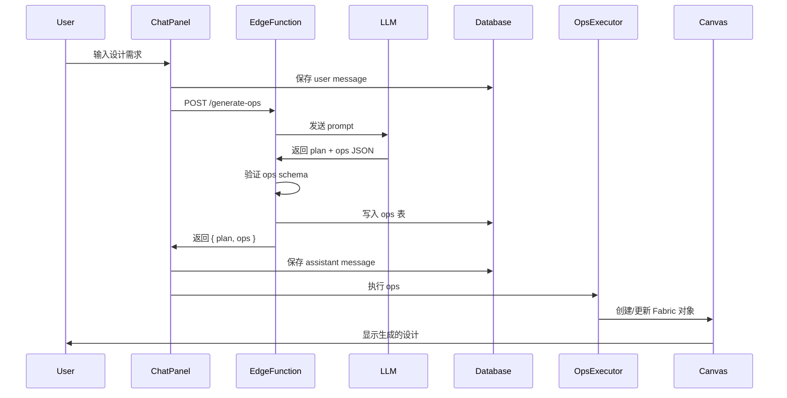

# Design Document: ChatCanvas

## Overview

ChatCanvas 是一个 ops 驱动的设计生成平台，用户通过聊天描述需求，AI 生成结构化的画布操作指令（ops），前端执行这些指令生成可编辑的设计。

## Prompt 契约（LLM 基线）

- **角色设定**: 你是 "ChatCanvas Design Agent"，职责是输出结构化设计计划 (`plan`) 与可执行 ops JSON，绝不输出自由文本。
- **输入格式**: `projectId`、`documentId`、`conversationId`、`prompt`，可选 `assetsContext`（可用图片/上传资源列表）。
- **输出格式**: 仅返回 JSON 对象 `{ "plan": string, "ops": Op[] }`，禁止附加文本；示例参见 schema 测试用例。
- **约束与安全**: 不得引用未提供的资源 URL；文本内容需安全、无版权敏感词；图片链接必须可公开访问或指向 Storage 签名 URL。
- **采样参数**: `temperature<=0.4`，`max_tokens` 约束在 900，禁止漫游；启用 `stop` 防止追加说明。
- **拒绝策略**: 当输入缺失关键尺寸/主题或请求违规内容时，返回 `{plan:"unable to comply: <reason>", ops:[]}` 并记录原因；不得输出模糊/不完整字段。
- **Few-shot 基线**: 提供 2-3 条示例（文字+图片+背景组合）覆盖常见海报与卡片，包含 wrap 宽度、渐变背景、主视觉对齐。
- **函数调用提示**: 明确只可使用 ops schema 里的 opType，禁止自造字段，ID 使用 `layer-<short-uuid>`。

### 核心设计理念

1. **Ops 驱动**: AI 不直接生成图片，而是输出结构化的 ops 指令
2. **可编辑性**: 所有生成的内容都是可编辑的 Fabric.js 对象
3. **可回放性**: 通过 ops 日志可以回放、撤销、重做任何操作
4. **实时协作基础**: ops 架构为未来多人协作奠定基础

### 技术架构

```
┌─────────────────────────────────────────────────────────────────────────┐
│                         Frontend (Next.js)                               │
├──────────┬────────────────────────────────────┬─────────────────────────┤
│  Left    │         Center                      │    Right                │
│ Toolbar  │       CanvasStage                   │   ChatPanel             │
│  (50px)  │       (Fabric.js)                   │   (380px)               │
│          │  ┌─────────────────────────────┐    │                         │
│  [选择]  │  │      Top Toolbar            │    │  [对话标题] [操作按钮]  │
│  [框选]  │  │  [名称] [缩放] [操作按钮]   │    │  ─────────────────────  │
│  [矩形]  │  ├─────────────────────────────┤    │  AI: 生成的图片预览     │
│  [文字]  │  │                             │    │      设计说明文字       │
│  [画笔]  │  │     Canvas Area             │    │  ─────────────────────  │
│  [图片]  │  │     (灰色点阵背景)          │    │  User: 用户输入         │
│  [AI]    │  │     [白色画布]              │    │  ─────────────────────  │
│          │  │                             │    │  [附件] [输入框] [发送] │
│          │  └─────────────────────────────┘    │                         │
├──────────┴────────────────────────────────────┴─────────────────────────┤
│                      OpsExecutor + Zustand Store                         │
├─────────────────────────────────────────────────────────────────────────┤
│                    Supabase Client                                       │
│         (Auth / Realtime / Storage / Database)                           │
└─────────────────────────────────────────────────────────────────────────┘
```

### 主页布局

```
┌─────────────────────────────────────────────────────────────────────────┐
│  [Logo]                                          [语言] [通知] [升级] [头像] │
├────┬────────────────────────────────────────────────────────────────────┤
│    │                                                                     │
│ +  │              [NEW] 立即升级，享受365天无限制...                      │
│    │                                                                     │
│ 🏠 │                    Logo 让设计更简单                                │
│    │                    懂你的设计代理，帮你搞定一切                      │
│ 📁 │                                                                     │
│    │         ┌─────────────────────────────────────────┐                │
│ 👤 │         │  让 AI 设计一张美丽的婚礼海报           │                │
│    │         │  [附件]                    [选项] [发送] │                │
│ ⚙️ │         └─────────────────────────────────────────┘                │
│    │                                                                     │
│    │         [Design] [Branding] [Illustration] [E-Commerce] [Video]    │
│    │                                                                     │
│    │  最近项目                                              查看全部 >   │
│    │  ┌────────┐ ┌────────┐ ┌────────┐ ┌────────┐                       │
│    │  │   +    │ │ 缩略图 │ │ 缩略图 │ │ 缩略图 │                       │
│    │  │新建项目│ │        │ │        │ │        │                       │
│    │  └────────┘ └────────┘ └────────┘ └────────┘                       │
│    │              未命名     未命名     未命名                            │
│    │           更新于...   更新于...   更新于...                          │
│    │                                                                     │
└────┴────────────────────────────────────────────────────────────────────┘
```

## Architecture

### 目录结构

```
src/
├── app/                          # Next.js App Router
│   ├── layout.tsx               # Root layout
│   ├── page.tsx                 # Landing / redirect to /app
│   ├── app/
│   │   ├── layout.tsx           # App layout with left sidebar
│   │   ├── page.tsx             # Homepage (Lovart-style)
│   │   └── p/
│   │       └── [projectId]/
│   │           └── page.tsx     # Editor page (Lovart-style)
│   └── api/                     # API routes (if needed)
├── components/
│   ├── layout/
│   │   ├── LeftSidebar.tsx      # 左侧固定导航栏
│   │   └── TopNav.tsx           # 顶部导航栏
│   ├── home/
│   │   ├── HomeInput.tsx        # 主页大输入框
│   │   ├── QuickTags.tsx        # 快捷标签
│   │   └── ProjectGrid.tsx      # 项目网格
│   ├── editor/
│   │   ├── LeftToolbar.tsx      # 左侧工具栏
│   │   ├── TopToolbar.tsx       # 顶部工具栏
│   │   └── EditorLayout.tsx     # 编辑器整体布局
│   ├── canvas/
│   │   └── CanvasStage.tsx      # Fabric.js canvas wrapper
│   ├── chat/
│   │   ├── ChatPanel.tsx        # 右侧 Chat 面板
│   │   ├── ChatMessage.tsx      # 消息组件
│   │   └── ChatInput.tsx        # 底部输入框
│   ├── export/
│   │   └── ExportButton.tsx     # Export controls
│   └── ui/                      # shadcn/ui components
├── lib/
│   ├── canvas/
│   │   ├── ops.types.ts         # Op type definitions
│   │   ├── opsExecutor.ts       # Op execution engine
│   │   └── export.ts            # PNG export utilities
│   ├── store/
│   │   └── editorStore.ts       # Zustand store
│   ├── supabase/
│   │   ├── client.ts            # Supabase client
│   │   └── queries/
│   │       ├── projects.ts
│   │       ├── messages.ts
│   │       └── ops.ts
│   ├── realtime/
│   │   ├── subscribeJobs.ts
│   │   └── subscribeOps.ts
│   └── export/
│       └── exportAndUpload.ts
├── ai/
│   └── schema/
│       ├── canvas_ops.schema.json
│       └── validate.ts
supabase/
├── schema.sql                   # Database schema
├── rls.sql                      # Row Level Security
├── storage.sql                  # Storage policies
└── functions/
    ├── generate-ops/
    │   └── index.ts
    └── generate-image/
        └── index.ts
docs/
├── architecture.md
├── conventions.md
├── storage.md
└── api.md
```

### 数据流



## Components and Interfaces

### 1. CanvasStage Component

```typescript
// src/components/canvas/CanvasStage.tsx

interface CanvasStageProps {
  documentId: string;
  width: number;
  height: number;
  initialOps?: Op[];
  onSelectionChange?: (layerId: string | null) => void;
  onLayersChange?: (layers: LayerInfo[]) => void;
}

interface LayerInfo {
  id: string;
  type: 'text' | 'image' | 'rect' | 'background';
  name: string;
  visible: boolean;
  locked: boolean;
}

// 核心方法
interface CanvasStageRef {
  executeOps(ops: Op[]): Promise<void>;
  exportPNG(multiplier: number): Promise<Blob>;
  selectLayer(layerId: string): void;
  deleteSelected(): void;
  undo(): void;
  redo(): void;
  getCanvasState(): CanvasState;
}
```

### 2. OpsExecutor

```typescript
// src/lib/canvas/opsExecutor.ts

interface OpsExecutorConfig {
  canvas: fabric.Canvas;
  onOpExecuted?: (op: Op, index: number) => void;
  onError?: (error: Error, op: Op) => void;
}

class OpsExecutor {
  private canvas: fabric.Canvas;
  private layerRegistry: Map<string, fabric.Object>;
  
  constructor(config: OpsExecutorConfig);
  
  // 执行 ops 数组
  async execute(ops: Op[]): Promise<void>;
  
  // 单个 op 执行
  private executeOp(op: Op): Promise<void>;
  
  // 各类型 op 处理器
  private handleSetBackground(payload: SetBackgroundPayload): void;
  private handleAddText(payload: AddTextPayload): Promise<void>;
  private handleAddImage(payload: AddImagePayload): Promise<void>;
  private handleUpdateLayer(payload: UpdateLayerPayload): void;
  private handleRemoveLayer(payload: RemoveLayerPayload): void;
  
  // 图层管理
  getLayerById(id: string): fabric.Object | undefined;
  getAllLayers(): LayerInfo[];
}
```

### 3. ChatPanel Component

```typescript
// src/components/chat/ChatPanel.tsx

interface ChatPanelProps {
  conversationId: string;
  projectId: string;
  documentId: string;
  onOpsGenerated?: (ops: Op[]) => void;
}

interface Message {
  id: string;
  role: 'user' | 'assistant' | 'system';
  content: string;
  metadata?: {
    plan?: string;
    ops?: Op[];
  };
  created_at: string;
}
```

### 4. LayersPanel Component

```typescript
// src/components/layers/LayersPanel.tsx

interface LayersPanelProps {
  layers: LayerInfo[];
  selectedLayerId: string | null;
  onSelectLayer: (layerId: string) => void;
  onDeleteLayer: (layerId: string) => void;
  onToggleVisibility: (layerId: string) => void;
}
```

### 5. Zustand Store

```typescript
// src/lib/store/editorStore.ts

interface EditorState {
  // Project state
  projectId: string | null;
  documentId: string | null;
  conversationId: string | null;
  
  // Canvas state
  layers: LayerInfo[];
  selectedLayerId: string | null;
  zoom: number;
  
  // Chat state
  messages: Message[];
  isGenerating: boolean;
  
  // Jobs state
  activeJobs: Job[];
  
  // Actions
  setProject(projectId: string, documentId: string, conversationId: string): void;
  setLayers(layers: LayerInfo[]): void;
  selectLayer(layerId: string | null): void;
  setZoom(zoom: number): void;
  addMessage(message: Message): void;
  setGenerating(isGenerating: boolean): void;
  addJob(job: Job): void;
  updateJob(jobId: string, updates: Partial<Job>): void;
}
```

## Data Models

### Database Schema (Postgres)

```sql
-- projects: 用户项目
CREATE TABLE projects (
  id UUID PRIMARY KEY DEFAULT gen_random_uuid(),
  user_id UUID NOT NULL REFERENCES auth.users(id) ON DELETE CASCADE,
  name TEXT NOT NULL DEFAULT 'Untitled Project',
  created_at TIMESTAMPTZ DEFAULT NOW(),
  updated_at TIMESTAMPTZ DEFAULT NOW()
);

-- documents: 画布文档
CREATE TABLE documents (
  id UUID PRIMARY KEY DEFAULT gen_random_uuid(),
  project_id UUID NOT NULL REFERENCES projects(id) ON DELETE CASCADE,
  name TEXT DEFAULT 'Untitled',
  canvas_state JSONB,
  width INTEGER DEFAULT 1080,
  height INTEGER DEFAULT 1350,
  created_at TIMESTAMPTZ DEFAULT NOW(),
  updated_at TIMESTAMPTZ DEFAULT NOW()
);

-- conversations: 聊天会话
CREATE TABLE conversations (
  id UUID PRIMARY KEY DEFAULT gen_random_uuid(),
  project_id UUID NOT NULL REFERENCES projects(id) ON DELETE CASCADE,
  document_id UUID REFERENCES documents(id) ON DELETE SET NULL,
  created_at TIMESTAMPTZ DEFAULT NOW()
);

-- messages: 聊天消息
CREATE TABLE messages (
  id UUID PRIMARY KEY DEFAULT gen_random_uuid(),
  conversation_id UUID NOT NULL REFERENCES conversations(id) ON DELETE CASCADE,
  role TEXT NOT NULL CHECK (role IN ('user', 'assistant', 'system')),
  content TEXT NOT NULL,
  metadata JSONB,
  created_at TIMESTAMPTZ DEFAULT NOW()
);

-- assets: 资产文件
CREATE TABLE assets (
  id UUID PRIMARY KEY DEFAULT gen_random_uuid(),
  project_id UUID NOT NULL REFERENCES projects(id) ON DELETE CASCADE,
  user_id UUID NOT NULL REFERENCES auth.users(id) ON DELETE CASCADE,
  type TEXT NOT NULL CHECK (type IN ('upload', 'generate', 'export')),
  storage_path TEXT NOT NULL,
  filename TEXT,
  mime_type TEXT,
  size_bytes BIGINT,
  metadata JSONB,
  created_at TIMESTAMPTZ DEFAULT NOW()
);

-- ops: 画布操作日志
CREATE TABLE ops (
  id UUID PRIMARY KEY DEFAULT gen_random_uuid(),
  document_id UUID NOT NULL REFERENCES documents(id) ON DELETE CASCADE,
  conversation_id UUID REFERENCES conversations(id) ON DELETE SET NULL,
  message_id UUID REFERENCES messages(id) ON DELETE SET NULL,
  seq BIGSERIAL,
  op_type TEXT NOT NULL,
  payload JSONB NOT NULL,
  created_at TIMESTAMPTZ DEFAULT NOW()
);

-- jobs: 异步任务
CREATE TABLE jobs (
  id UUID PRIMARY KEY DEFAULT gen_random_uuid(),
  project_id UUID NOT NULL REFERENCES projects(id) ON DELETE CASCADE,
  document_id UUID NOT NULL REFERENCES documents(id) ON DELETE CASCADE,
  user_id UUID NOT NULL REFERENCES auth.users(id) ON DELETE CASCADE,
  type TEXT NOT NULL CHECK (type IN ('generate-image')),
  status TEXT NOT NULL DEFAULT 'queued' CHECK (status IN ('queued', 'processing', 'done', 'failed')),
  input JSONB NOT NULL,
  output JSONB,
  error TEXT,
  created_at TIMESTAMPTZ DEFAULT NOW(),
  updated_at TIMESTAMPTZ DEFAULT NOW()
);

-- Indexes
CREATE INDEX idx_projects_user_id ON projects(user_id);
CREATE INDEX idx_documents_project_id ON documents(project_id);
CREATE INDEX idx_conversations_project_id ON conversations(project_id);
CREATE INDEX idx_messages_conversation_id ON messages(conversation_id);
CREATE INDEX idx_assets_project_id ON assets(project_id);
CREATE INDEX idx_ops_document_id ON ops(document_id);
CREATE INDEX idx_ops_seq ON ops(document_id, seq);
CREATE INDEX idx_jobs_project_id ON jobs(project_id);
CREATE INDEX idx_jobs_status ON jobs(status);
```

### Op Types (TypeScript)

```typescript
// src/lib/canvas/ops.types.ts

type OpType = 
  | 'createFrame'
  | 'setBackground'
  | 'addText'
  | 'addImage'
  | 'updateLayer'
  | 'removeLayer';

interface BaseOp {
  type: OpType;
}

interface CreateFrameOp extends BaseOp {
  type: 'createFrame';
  payload: {
    width: number;
    height: number;
    backgroundColor?: string;
  };
}

interface SetBackgroundOp extends BaseOp {
  type: 'setBackground';
  payload: {
    backgroundType: 'solid' | 'gradient' | 'image';
    value: string | GradientConfig | string; // color | gradient | imageUrl
  };
}

interface GradientConfig {
  type: 'linear' | 'radial';
  colorStops: Array<{ offset: number; color: string }>;
  coords?: { x1: number; y1: number; x2: number; y2: number };
}

interface AddTextOp extends BaseOp {
  type: 'addText';
  payload: {
    id: string;
    text: string;
    x: number;
    y: number;
    fontSize?: number;      // default: 24
    fontFamily?: string;    // default: 'Inter'
    fill?: string;          // default: '#000000'
    fontWeight?: string;    // default: 'normal'
    textAlign?: 'left' | 'center' | 'right';
    width?: number;
  };
}

interface AddImageOp extends BaseOp {
  type: 'addImage';
  payload: {
    id: string;
    src: string;
    x: number;
    y: number;
    width?: number;
    height?: number;
    scaleX?: number;
    scaleY?: number;
  };
}

interface UpdateLayerOp extends BaseOp {
  type: 'updateLayer';
  payload: {
    id: string;
    properties: Record<string, unknown>;
  };
}

interface RemoveLayerOp extends BaseOp {
  type: 'removeLayer';
  payload: {
    id: string;
  };
}

type Op = 
  | CreateFrameOp 
  | SetBackgroundOp 
  | AddTextOp 
  | AddImageOp 
  | UpdateLayerOp 
  | RemoveLayerOp;

interface GenerateOpsResponse {
  plan: string;
  ops: Op[];
}
```

## Correctness Properties

*A property is a characteristic or behavior that should hold true across all valid executions of a system—essentially, a formal statement about what the system should do. Properties serve as the bridge between human-readable specifications and machine-verifiable correctness guarantees.*

### Property 1: Data Isolation

*For any* two authenticated users A and B, user A SHALL NOT be able to read, update, or delete any resource (project, document, conversation, message, asset, op, job) owned by user B.

**Validates: Requirements 3.2, 3.3, 3.4, 3.5, 3.6, 3.7, 3.8, 3.9**

### Property 2: Ops Schema Validation Round-Trip

*For any* valid ops JSON that conforms to the schema, serializing to string and parsing back SHALL produce an equivalent object that passes validation. *For any* invalid ops JSON, validation SHALL return errors and reject the input.

**Validates: Requirements 8.7, 12.6, 16.5, 16.6**

### Property 3: Ops Execution Correctness

*For any* valid ops array, executing through OpsExecutor SHALL produce a canvas state where:
- Each `addText` op results in a Fabric IText object with matching properties
- Each `addImage` op results in a Fabric Image object at the specified position
- Each `setBackground` op results in the correct background color/gradient
- Each `updateLayer` op modifies only the specified layer's properties
- Each `removeLayer` op removes exactly the specified layer

**Validates: Requirements 9.1, 9.3, 9.4, 9.5, 9.6, 9.7, 9.8**

### Property 4: Layer Registry Consistency

*For any* sequence of ops executed on a canvas, the OpsExecutor's layer registry SHALL contain exactly one entry for each layer id that was added and not removed. Looking up a layer by id SHALL return the corresponding Fabric object.

**Validates: Requirements 9.9**

### Property 5: Project Creation Invariant

*For any* newly created project, the database SHALL contain exactly one document record and exactly one conversation record linked to that project.

**Validates: Requirements 5.3**

### Property 6: Cascade Delete Completeness

*For any* deleted project, all related records in documents, conversations, messages, assets, ops, and jobs tables SHALL be deleted. No orphan records SHALL remain.

**Validates: Requirements 5.5**

### Property 7: Storage Path Format

*For any* asset stored in the system, the storage_path SHALL match the pattern `{userId}/{projectId}/{assetId}.{ext}` where userId, projectId, and assetId are valid UUIDs.

**Validates: Requirements 4.2**

### Property 8: Job State Machine

*For any* job, the status transitions SHALL follow: `queued → processing → done` OR `queued → processing → failed`. No other transitions are valid. A job in `done` or `failed` status SHALL NOT transition to any other status.

**Validates: Requirements 13.3, 13.4, 13.5**

### Property 9: Export Fidelity

*For any* canvas state, exporting to PNG and comparing pixel data SHALL produce an image that matches the visible canvas content within acceptable tolerance (accounting for anti-aliasing).

**Validates: Requirements 15.4**

### Property 10: Invalid Op Rejection

*For any* op with missing required fields, invalid field types, or unknown op types, the OpsExecutor SHALL throw an error and NOT modify the canvas state.

**Validates: Requirements 9.2**

### Property 11: Idempotent Ops Application

*For any* ops stream with duplicate `seq` for the same `document_id`, executing ops multiple times SHALL result in a single application per `seq` without duplicating layers or side effects.

**Validates: Requirements 19.1, 19.2**

### Property 12: Realtime Replay Safety

*For any* reconnect or subscription event, replayed ops SHALL be deduplicated, and the resulting canvas state SHALL match the state if each op were applied exactly once in order.

**Validates: Requirements 14.5, 19.2**

### Property 13: Job Retry Boundaries

*For any* job in `queued` or `processing`, retries SHALL be bounded (max attempts configurable) and SHALL NOT produce more than one asset or op insertion per job id.

**Validates: Requirements 13.3, 19.3**

## Error Handling

### Frontend Error Handling

```typescript
// Error types
enum ErrorCode {
  VALIDATION_ERROR = 'VALIDATION_ERROR',
  NETWORK_ERROR = 'NETWORK_ERROR',
  AUTH_ERROR = 'AUTH_ERROR',
  CANVAS_ERROR = 'CANVAS_ERROR',
  STORAGE_ERROR = 'STORAGE_ERROR',
  AI_ERROR = 'AI_ERROR',
}

interface AppError {
  code: ErrorCode;
  message: string;
  details?: unknown;
}

// Error handling in OpsExecutor
class OpsExecutor {
  async execute(ops: Op[]): Promise<void> {
    // Validate all ops before execution
    const validation = validateOps(ops);
    if (!validation.valid) {
      throw new AppError({
        code: ErrorCode.VALIDATION_ERROR,
        message: 'Invalid ops',
        details: validation.errors,
      });
    }
    
    // Execute ops - if any fails, stop immediately
    for (const op of ops) {
      try {
        await this.executeOp(op);
      } catch (error) {
        throw new AppError({
          code: ErrorCode.CANVAS_ERROR,
          message: `Failed to execute op: ${op.type}`,
          details: { op, originalError: error },
        });
      }
    }
  }
}
```

### Edge Function Error Handling

```typescript
// generate-ops error responses
interface ErrorResponse {
  error: {
    code: string;
    message: string;
  };
}

// Error codes
const ERROR_CODES = {
  UNAUTHORIZED: 'UNAUTHORIZED',
  INVALID_REQUEST: 'INVALID_REQUEST',
  VALIDATION_FAILED: 'VALIDATION_FAILED',
  AI_ERROR: 'AI_ERROR',
  INTERNAL_ERROR: 'INTERNAL_ERROR',
};

// Example error handling
if (!isValidRequest(body)) {
  return new Response(
    JSON.stringify({
      error: {
        code: ERROR_CODES.INVALID_REQUEST,
        message: 'Missing required fields',
      },
    }),
    { status: 400 }
  );
}
```

### Job Error Handling

```typescript
// Job failure handling
async function processJob(jobId: string) {
  try {
    await updateJobStatus(jobId, 'processing');
    
    // ... processing logic ...
    
    await updateJobStatus(jobId, 'done', { output: result });
  } catch (error) {
    await updateJobStatus(jobId, 'failed', {
      error: error instanceof Error ? error.message : 'Unknown error',
    });
  }
}
```

## Testing Strategy

### Unit Tests

使用 Vitest 进行单元测试：

1. **Ops Validation Tests**
   - 测试每种 op 类型的 schema 验证
   - 测试缺少必填字段的情况
   - 测试字段类型错误的情况

2. **OpsExecutor Tests**
   - 测试每种 op 的执行结果
   - 测试无效 op 的错误处理
   - 测试 layer registry 的一致性

3. **Store Tests**
   - 测试 Zustand store 的状态更新
   - 测试 actions 的正确性

### Property-Based Tests

使用 fast-check 进行属性测试：

```typescript
import fc from 'fast-check';
import { validateOps } from '../src/ai/schema/validate';

// Property 2: Ops Schema Validation Round-Trip
describe('Ops Schema Validation', () => {
  it('should validate and round-trip valid ops', () => {
    fc.assert(
      fc.property(validOpsArbitrary, (ops) => {
        const json = JSON.stringify(ops);
        const parsed = JSON.parse(json);
        const result = validateOps(parsed);
        return result.valid === true;
      }),
      { numRuns: 100 }
    );
  });
  
  it('should reject invalid ops', () => {
    fc.assert(
      fc.property(invalidOpsArbitrary, (ops) => {
        const result = validateOps(ops);
        return result.valid === false && result.errors.length > 0;
      }),
      { numRuns: 100 }
    );
  });
});

// Property 8: Job State Machine
describe('Job State Machine', () => {
  it('should only allow valid state transitions', () => {
    fc.assert(
      fc.property(jobStateSequenceArbitrary, (transitions) => {
        return isValidStateSequence(transitions);
      }),
      { numRuns: 100 }
    );
  });
});
```

### Integration Tests

1. **API Tests**
   - 测试 generate-ops Edge Function
   - 测试 generate-image Edge Function
   - 测试 RLS 策略

2. **E2E Tests** (Playwright)
   - 测试完整的用户流程
   - 测试聊天到画布生成
   - 测试导出功能

### Test Configuration

```typescript
// vitest.config.ts
export default defineConfig({
  test: {
    globals: true,
    environment: 'jsdom',
    setupFiles: ['./tests/setup.ts'],
    coverage: {
      provider: 'v8',
      reporter: ['text', 'json', 'html'],
    },
  },
});
```

### Property Test Annotations

每个属性测试必须包含注释引用设计文档中的属性：

```typescript
/**
 * Feature: chat-canvas
 * Property 2: Ops Schema Validation Round-Trip
 * Validates: Requirements 8.7, 12.6, 16.5, 16.6
 */
test.prop([validOpsArbitrary])('ops round-trip validation', (ops) => {
  // test implementation
});
```
