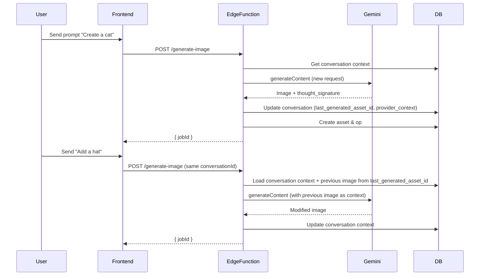

# Design Document

## Overview

本设计文档描述 Gemini 图像生成（Nano Banana）功能的技术实现方案，包括多轮对话编辑、会员分辨率控制、前端模型选择等核心能力。

## Architecture

```mermaid
flowchart TB
    subgraph Frontend
        ChatPanel[ChatPanel.tsx]
        ModelSelector[Model Selector]
        ResolutionSelector[Resolution Selector]
    end
    
    subgraph "Next.js API"
        APIRoute[/api/generate-image]
    end
    
    subgraph "Supabase Edge Functions"
        GenerateImage[generate-image/index.ts]
        GeminiProvider[Gemini Provider]
        VolcengineProvider[Volcengine Provider]
    end
    
    subgraph "External APIs"
        GeminiAPI[Google Gemini API]
    end
    
    subgraph "Supabase"
        DB[(PostgreSQL)]
        Storage[(Storage)]
    end
    
    ChatPanel --> APIRoute
    ModelSelector --> ChatPanel
    ResolutionSelector --> ChatPanel
    APIRoute --> GenerateImage
    GenerateImage --> GeminiProvider
    GenerateImage --> VolcengineProvider
    GeminiProvider --> GeminiAPI
    GenerateImage --> DB
    GenerateImage --> Storage
```


## Components and Interfaces

### 1. Gemini Provider (Edge Function)

```typescript
interface GeminiGenerateOptions {
  prompt: string;
  model: 'gemini-2.5-flash-image' | 'gemini-3-pro-image-preview';
  aspectRatio?: '1:1' | '16:9' | '9:16' | '4:3' | '3:4' | '2:3' | '3:2' | '4:5' | '5:4' | '21:9';
  imageSize?: '1K' | '2K' | '4K';
  referenceImageUrl?: string;
  conversationId?: string;
}

interface GeminiGenerateResult {
  imageUrl: string;  // base64 data URL
  thoughtSignature?: string;
}

async function generateImageGemini(options: GeminiGenerateOptions): Promise<GeminiGenerateResult>
```

- imageSize → `imageConfig` mapping: 1K→`maxDimension=1024`, 2K→2048, 4K→4096; width/height derived from aspect ratio.
- Use `system_settings.gemini_api_host` to build the `generateContent` URL; default to `https://generativelanguage.googleapis.com`.
- Use the returned base64 data URL only for upload to Supabase Storage; do not persist raw base64.
- Validate model/resolution compatibility before calling the API to avoid 4xx from Gemini.

### 2. Conversation Context Manager

```typescript
interface ConversationContext {
  lastGeneratedAssetId?: string;
  providerContext: {
    gemini?: { thoughtSignature?: string };
    volcengine?: { taskId?: string };
  };
}

// Functions to manage conversation context
async function getConversationContext(conversationId: string): Promise<ConversationContext>
async function updateConversationContext(conversationId: string, updates: Partial<ConversationContext>): Promise<void>
```

### 3. Resolution Permission Checker

```typescript
interface ResolutionPermission {
  maxResolution: '1K' | '2K' | '4K';
  membershipLevel: 'free' | 'pro' | 'team';
}

async function checkResolutionPermission(
  userId: string, 
  requestedResolution: string
): Promise<{ allowed: boolean; maxAllowed: string; upgradeRequired?: string }>
```

### 4. Request/Response Types

```typescript
// Extended RequestBody for Gemini
interface GenerateImageRequest {
  projectId: string;
  documentId: string;
  prompt: string;
  model?: string;
  width?: number;
  height?: number;
  conversationId?: string;
  imageUrl?: string;
  placeholderX?: number;
  placeholderY?: number;
  // New Gemini-specific fields
  aspectRatio?: string;
  imageSize?: '1K' | '2K' | '4K';
}

interface GenerateImageResponse {
  jobId: string;
  pointsDeducted: number;
  remainingPoints: number;
  modelUsed: string;
}
```

## Request Validation & Processing Flow

1. Normalize request: default `model` to `gemini-2.5-flash-image`, `aspectRatio` to `1:1`, and `imageSize` to `1K` when omitted.
2. Map `imageSize` to concrete pixel targets (1K~1024px, 2K~2048px, 4K~4096px) and derive `width`/`height` from aspect ratio before enqueueing jobs and before calling Gemini.
3. Validate membership resolution permission and model capability; reject unsupported combinations (e.g., flash-image + 4K) with `RESOLUTION_NOT_ALLOWED`.
4. Validate reference images belong to the requesting user (assets bucket) or are signed URLs before including them as inlineData.
5. Route through existing `jobs` table: insert `generate-image` job with Gemini-specific payload, then process asynchronously in the Edge Function.
6. Deduct points via existing `deduct_points` RPC in the same transactional flow as job creation; if job insert fails, roll back or compensate the deduction.


## Data Models

### jobs Table (existing)
- Reuse `jobs` table for `generate-image` with Gemini payload; states remain `queued → processing → done/failed`.
- `input` JSON MUST include model, aspectRatio, imageSize, conversationId, and reference image metadata.
- `output` JSON MUST include asset_id, storage_path, public_url, layer_id/op payload, model_used, and points_deducted.

### ai_models Table Extension

```sql
-- Add Gemini image models
INSERT INTO ai_models (name, display_name, type, provider, points_cost, is_active) VALUES
  ('gemini-3-pro-image-preview', 'Nano Banana Pro', 'image', 'google', 40, true);
```

### membership_configs.perks Extension

```sql
-- Update perks to include max_image_resolution
UPDATE membership_configs SET perks = perks || '{"max_image_resolution": "1K"}'::jsonb WHERE level = 'free';
UPDATE membership_configs SET perks = perks || '{"max_image_resolution": "2K"}'::jsonb WHERE level = 'pro';
UPDATE membership_configs SET perks = perks || '{"max_image_resolution": "4K"}'::jsonb WHERE level = 'team';
```

### system_settings for API Host

```sql
INSERT INTO system_settings (key, value, description) VALUES
  ('gemini_api_host', '{"host": "https://generativelanguage.googleapis.com"}'::jsonb, 'Gemini API host URL, can be customized for proxy')
ON CONFLICT (key) DO NOTHING;
```

### conversations Table Extension (Multi-Turn Support)

```sql
-- Add fields for multi-turn image editing context
-- Requirements: 2.6, 2.7, 7.9
ALTER TABLE conversations ADD COLUMN IF NOT EXISTS 
  last_generated_asset_id UUID REFERENCES assets(id) ON DELETE SET NULL;

ALTER TABLE conversations ADD COLUMN IF NOT EXISTS 
  provider_context JSONB DEFAULT '{}'::jsonb;

-- provider_context stores provider-specific state:
-- {
--   "gemini": { "thought_signature": "xxx" },
--   "volcengine": { "task_id": "yyy" }
-- }
```

## Multi-Turn Chat Flow




## Correctness Properties

*A property is a characteristic or behavior that should hold true across all valid executions of a system—essentially, a formal statement about what the system should do. Properties serve as the bridge between human-readable specifications and machine-verifiable correctness guarantees.*

### Property 1: Resolution Permission Enforcement

*For any* user with a given membership level and *for any* requested image resolution, the system SHALL allow the request if and only if the resolution is within the user's permitted maximum (free=1K, pro=2K, team=4K).

**Validates: Requirements 3.2, 3.3, 3.4, 3.5**

### Property 2: Points Cost by Resolution

*For any* image generation request using gemini-3-pro-image-preview, the points deducted SHALL equal base_cost × multiplier where multiplier is 1.0 for 1K, 1.5 for 2K, and 2.0 for 4K.

**Validates: Requirements 5.3, 5.4, 5.5**

### Property 3: Conversation Context Lifecycle

*For any* conversation, the first image generation request SHALL initialize the conversation context, and *for any* subsequent request in the same conversation, the system SHALL reuse the existing context and include the previous generated image.

**Validates: Requirements 2.1, 2.2, 2.5, 2.6**

### Property 4: Asset and Op Creation

*For any* successful image generation, the system SHALL create exactly one asset record in the database AND exactly one addImage op for the document.

**Validates: Requirements 1.5, 1.6**

### Property 5: Reference Image Inclusion

*For any* image-to-image editing request with a reference image URL, the Gemini API request SHALL include the reference image as inlineData in the request parts.

**Validates: Requirements 1.4, 2.3**

### Property 6: Aspect Ratio Passthrough

*For any* valid aspect ratio selection from the supported set (1:1, 16:9, 9:16, 4:3, 3:4, 2:3, 3:2, 4:5, 5:4, 21:9), the system SHALL include the exact aspect ratio in the Gemini API imageConfig.

**Validates: Requirements 4.1, 4.2**

### Property 7: Insufficient Points Rejection

*For any* user with points balance less than the required cost, the system SHALL reject the request with INSUFFICIENT_POINTS error and SHALL NOT deduct any points.

**Validates: Requirements 5.6**


## Error Handling

| Error Code | HTTP Status | Description |
|------------|-------------|-------------|
| UNAUTHORIZED | 401 | Missing or invalid authorization |
| INVALID_REQUEST | 400 | Missing required fields or invalid parameters |
| INSUFFICIENT_POINTS | 402 | User doesn't have enough points |
| RESOLUTION_NOT_ALLOWED | 403 | Requested resolution exceeds membership permission or model capability |
| GEMINI_API_ERROR | 502 | Gemini API returned an error |
| INTERNAL_ERROR | 500 | Unexpected server error |

## Testing Strategy

### Unit Tests
- Test resolution permission checker with different membership levels
- Test points cost calculator with different resolutions
- Test aspect ratio validation
- Test conversation context retrieval and update

### Property-Based Tests (fast-check)
- Property 1: Generate random membership levels and resolutions, verify permission logic
- Property 2: Generate random resolutions, verify points multiplier calculation
- Property 3: Generate sequences of requests, verify context reuse
- Property 6: Generate random aspect ratios from valid set, verify passthrough

### Integration Tests
- Test full flow: request → Gemini API → storage → asset → op
- Test multi-turn conversation flow
- Test points deduction transaction

### Configuration
- Use Vitest with fast-check for property-based testing
- Minimum 100 iterations per property test
- Mock Gemini API responses for deterministic testing
