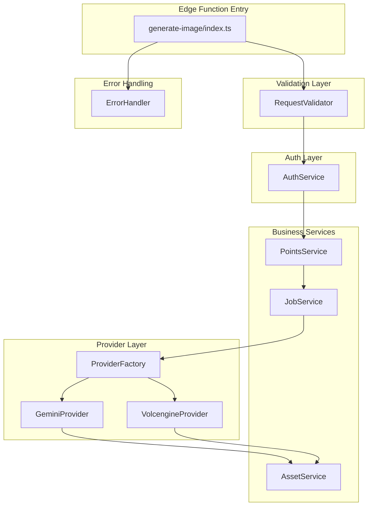
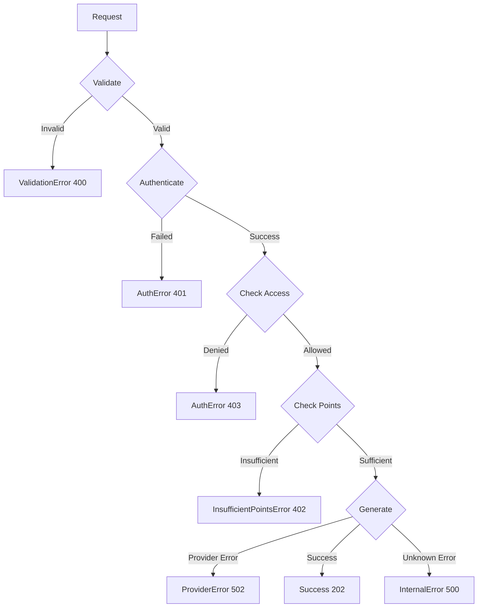

# Design Document: Image Generation Refactor

## Overview

本设计将现有的 900+ 行 `generate-image` Edge Function 重构为模块化架构。采用 Provider 模式抽象图片生成服务，Service 模式封装业务逻辑，实现关注点分离和可测试性。

## Architecture



## Components and Interfaces

### 1. Provider Interface (`_shared/providers/types.ts`)

```typescript
/**
 * Image generation result from any provider
 */
export interface ImageResult {
  imageData: ArrayBuffer;
  mimeType: string;
  width?: number;
  height?: number;
  metadata?: Record<string, unknown>;
}

/**
 * Common request parameters for all providers
 */
export interface ProviderRequest {
  prompt: string;
  width?: number;
  height?: number;
  aspectRatio?: AspectRatio;
  resolution?: ResolutionPreset;
  referenceImageBase64?: string;
  referenceImageMimeType?: string;
}

/**
 * Provider capabilities declaration
 */
export interface ProviderCapabilities {
  supportsImageToImage: boolean;
  maxResolution: ResolutionPreset;
  supportedAspectRatios: AspectRatio[];
}

/**
 * Abstract interface for image generation providers
 */
export interface ImageProvider {
  readonly name: string;
  readonly capabilities: ProviderCapabilities;
  
  /**
   * Generate image from request
   * @throws ProviderError on generation failure
   */
  generate(request: ProviderRequest): Promise<ImageResult>;
  
  /**
   * Validate request against provider capabilities
   */
  validateRequest(request: ProviderRequest): ValidationResult;
}
```

### 2. Provider Factory (`_shared/providers/factory.ts`)

```typescript
/**
 * Factory for creating provider instances
 */
export class ProviderFactory {
  private providers: Map<string, () => ImageProvider>;
  
  constructor(private supabase: SupabaseClient) {
    this.providers = new Map([
      ['gemini-2.5-flash-image', () => new GeminiProvider(supabase, 'gemini-2.5-flash-image')],
      ['gemini-3-pro-image-preview', () => new GeminiProvider(supabase, 'gemini-3-pro-image-preview')],
      ['doubao-seedream-4-5-251128', () => new VolcengineProvider()],
    ]);
  }
  
  /**
   * Get provider for model name
   * @throws ProviderError if model not supported
   */
  getProvider(modelName: string): ImageProvider {
    const factory = this.providers.get(modelName);
    if (!factory) {
      throw new ProviderError(`Unsupported model: ${modelName}`, 'MODEL_NOT_SUPPORTED');
    }
    return factory();
  }
  
  /**
   * Check if model is supported
   */
  isSupported(modelName: string): boolean {
    return this.providers.has(modelName);
  }
  
  /**
   * Get default provider (Volcengine)
   */
  getDefaultProvider(): ImageProvider {
    return new VolcengineProvider();
  }
}
```

### 3. Gemini Provider (`_shared/providers/gemini.ts`)

```typescript
export class GeminiProvider implements ImageProvider {
  readonly name: string;
  readonly capabilities: ProviderCapabilities;
  
  constructor(
    private supabase: SupabaseClient,
    private modelName: GeminiModelName
  ) {
    this.name = modelName;
    this.capabilities = {
      supportsImageToImage: true,
      maxResolution: GEMINI_MODELS[modelName].maxResolution,
      supportedAspectRatios: [...SUPPORTED_ASPECT_RATIOS],
    };
  }
  
  async generate(request: ProviderRequest): Promise<ImageResult> {
    const apiKey = Deno.env.get('GEMINI_API_KEY');
    if (!apiKey) throw new ProviderError('GEMINI_API_KEY not configured', 'CONFIG_ERROR');
    
    const apiHost = await this.getApiHost();
    const requestBody = this.buildRequestBody(request);
    
    const response = await fetch(
      `${apiHost}/v1beta/models/${this.modelName}:generateContent?key=${apiKey}`,
      {
        method: 'POST',
        headers: { 'Content-Type': 'application/json' },
        body: JSON.stringify(requestBody),
      }
    );
    
    if (!response.ok) {
      const errorText = await response.text();
      throw new ProviderError(`Gemini API error: ${response.status}`, 'API_ERROR', errorText);
    }
    
    return this.parseResponse(await response.json());
  }
  
  validateRequest(request: ProviderRequest): ValidationResult {
    const errors: string[] = [];
    
    if (request.resolution && !this.isResolutionSupported(request.resolution)) {
      errors.push(`Resolution ${request.resolution} exceeds model max ${this.capabilities.maxResolution}`);
    }
    
    if (request.aspectRatio && !this.capabilities.supportedAspectRatios.includes(request.aspectRatio)) {
      errors.push(`Aspect ratio ${request.aspectRatio} not supported`);
    }
    
    return { valid: errors.length === 0, errors };
  }
  
  private async getApiHost(): Promise<string> {
    // Implementation from existing gemini-provider.ts
  }
  
  private buildRequestBody(request: ProviderRequest): Record<string, unknown> {
    // Implementation from existing gemini-provider.ts
  }
  
  private parseResponse(data: Record<string, unknown>): ImageResult {
    // Implementation from existing gemini-provider.ts
  }
  
  private isResolutionSupported(resolution: ResolutionPreset): boolean {
    return RESOLUTION_PRESETS[resolution] <= RESOLUTION_PRESETS[this.capabilities.maxResolution];
  }
}
```

### 4. Volcengine Provider (`_shared/providers/volcengine.ts`)

```typescript
export class VolcengineProvider implements ImageProvider {
  readonly name = 'volcengine';
  readonly capabilities: ProviderCapabilities = {
    supportsImageToImage: true,
    maxResolution: '2K',
    supportedAspectRatios: ['1:1'],
  };
  
  async generate(request: ProviderRequest): Promise<ImageResult> {
    const apiKey = Deno.env.get('VOLCENGINE_API_KEY');
    if (!apiKey) throw new ProviderError('VOLCENGINE_API_KEY not configured', 'CONFIG_ERROR');
    
    const model = Deno.env.get('VOLCENGINE_IMAGE_MODEL') || 'doubao-seedream-4-5-251128';
    
    const response = await fetch('https://ark.cn-beijing.volces.com/api/v3/images/generations', {
      method: 'POST',
      headers: {
        'Content-Type': 'application/json',
        'Authorization': `Bearer ${apiKey}`,
      },
      body: JSON.stringify({
        model,
        prompt: request.prompt,
        size: '2K',
        watermark: false,
        sequential_image_generation: 'disabled',
        ...(request.referenceImageBase64 && { image: [request.referenceImageBase64] }),
      }),
    });
    
    if (!response.ok) {
      const errorText = await response.text();
      throw new ProviderError(`Volcengine API error: ${response.status}`, 'API_ERROR', errorText);
    }
    
    return this.parseResponse(await response.json());
  }
  
  validateRequest(request: ProviderRequest): ValidationResult {
    return { valid: true, errors: [] };
  }
  
  private parseResponse(data: Record<string, unknown>): ImageResult {
    const imageData = (data.data as Array<{ url?: string; b64_json?: string }>)?.[0];
    if (!imageData) throw new ProviderError('No image data in response', 'PARSE_ERROR');
    
    if (imageData.b64_json) {
      return {
        imageData: base64ToArrayBuffer(imageData.b64_json),
        mimeType: 'image/png',
      };
    }
    
    if (imageData.url) {
      // Need to download the image
      throw new ProviderError('URL response not yet supported', 'NOT_IMPLEMENTED');
    }
    
    throw new ProviderError('Invalid response format', 'PARSE_ERROR');
  }
}
```

### 5. Request Validator (`_shared/validators/request.ts`)

```typescript
export interface ValidatedRequest {
  projectId: string;
  documentId: string;
  prompt: string;
  model: string;
  width: number;
  height: number;
  conversationId?: string;
  imageUrl?: string;
  placeholderX?: number;
  placeholderY?: number;
  aspectRatio?: AspectRatio;
  resolution?: ResolutionPreset;
}

export interface ValidationResult {
  valid: boolean;
  errors: string[];
  data?: ValidatedRequest;
}

export class RequestValidator {
  /**
   * Validate and transform raw request body
   */
  validate(body: unknown): ValidationResult {
    const errors: string[] = [];
    
    if (!body || typeof body !== 'object') {
      return { valid: false, errors: ['Request body must be an object'] };
    }
    
    const b = body as Record<string, unknown>;
    
    // Required fields
    if (!this.isNonEmptyString(b.projectId)) {
      errors.push('projectId is required and must be a non-empty string');
    }
    if (!this.isNonEmptyString(b.documentId)) {
      errors.push('documentId is required and must be a non-empty string');
    }
    if (!this.isNonEmptyString(b.prompt)) {
      errors.push('prompt is required and must be a non-empty string');
    }
    
    // Optional fields with type validation
    if (b.aspectRatio !== undefined && !this.isValidAspectRatio(b.aspectRatio)) {
      errors.push(`Invalid aspectRatio: ${b.aspectRatio}`);
    }
    if (b.resolution !== undefined && !this.isValidResolution(b.resolution)) {
      errors.push(`Invalid resolution: ${b.resolution}`);
    }
    
    if (errors.length > 0) {
      return { valid: false, errors };
    }
    
    return {
      valid: true,
      errors: [],
      data: {
        projectId: b.projectId as string,
        documentId: b.documentId as string,
        prompt: b.prompt as string,
        model: (b.model as string) || 'doubao-seedream-4-5-251128',
        width: (b.width as number) || 1024,
        height: (b.height as number) || 1024,
        conversationId: b.conversationId as string | undefined,
        imageUrl: b.imageUrl as string | undefined,
        placeholderX: b.placeholderX as number | undefined,
        placeholderY: b.placeholderY as number | undefined,
        aspectRatio: b.aspectRatio as AspectRatio | undefined,
        resolution: b.resolution as ResolutionPreset | undefined,
      },
    };
  }
  
  private isNonEmptyString(value: unknown): value is string {
    return typeof value === 'string' && value.length > 0;
  }
  
  private isValidAspectRatio(value: unknown): value is AspectRatio {
    return typeof value === 'string' && SUPPORTED_ASPECT_RATIOS.includes(value as AspectRatio);
  }
  
  private isValidResolution(value: unknown): value is ResolutionPreset {
    return typeof value === 'string' && value in RESOLUTION_PRESETS;
  }
}
```

### 6. Auth Service (`_shared/services/auth.ts`)

```typescript
export interface AuthenticatedUser {
  id: string;
  email?: string;
}

export interface UserMembership {
  level: 'free' | 'pro' | 'team';
  maxResolution: ResolutionPreset;
}

export class AuthService {
  constructor(
    private supabaseUrl: string,
    private supabaseAnonKey: string
  ) {}
  
  /**
   * Validate user from auth header
   * @throws AuthError if invalid
   */
  async validateUser(authHeader: string | null): Promise<{ user: AuthenticatedUser; client: SupabaseClient }> {
    if (!authHeader) {
      throw new AuthError('Missing authorization header', 'MISSING_AUTH');
    }
    
    const client = createClient(this.supabaseUrl, this.supabaseAnonKey, {
      global: { headers: { Authorization: authHeader } },
    });
    
    const { data: { user }, error } = await client.auth.getUser();
    
    if (error || !user) {
      throw new AuthError('Invalid authentication', 'INVALID_AUTH');
    }
    
    return { user: { id: user.id, email: user.email }, client };
  }
  
  /**
   * Validate user has access to project
   * @throws AuthError if no access
   */
  async validateProjectAccess(client: SupabaseClient, projectId: string): Promise<void> {
    const { data } = await client.from('projects').select('id').eq('id', projectId).single();
    
    if (!data) {
      throw new AuthError('Project not found or no access', 'PROJECT_ACCESS_DENIED');
    }
  }
  
  /**
   * Validate user has access to document
   * @throws AuthError if no access
   */
  async validateDocumentAccess(client: SupabaseClient, documentId: string): Promise<void> {
    const { data } = await client.from('documents').select('id').eq('id', documentId).single();
    
    if (!data) {
      throw new AuthError('Document not found', 'DOCUMENT_NOT_FOUND');
    }
  }
  
  /**
   * Get user's membership level and permissions
   */
  async getUserMembership(serviceClient: SupabaseClient, userId: string): Promise<UserMembership> {
    const { data } = await serviceClient
      .from('memberships')
      .select('level, membership_configs!inner(perks)')
      .eq('user_id', userId)
      .single();
    
    if (!data) {
      return { level: 'free', maxResolution: '1K' };
    }
    
    const perks = (data.membership_configs as { perks: { max_image_resolution?: string } })?.perks;
    const maxRes = perks?.max_image_resolution as ResolutionPreset | undefined;
    
    return {
      level: data.level as 'free' | 'pro' | 'team',
      maxResolution: maxRes && maxRes in RESOLUTION_PRESETS ? maxRes : '1K',
    };
  }
}
```

### 7. Points Service (`_shared/services/points.ts`)

```typescript
export interface DeductResult {
  success: boolean;
  pointsDeducted: number;
  balanceAfter: number;
  transactionId: string;
}

export class PointsService {
  constructor(private supabase: SupabaseClient) {}
  
  /**
   * Calculate points cost for model and resolution
   */
  async calculateCost(modelName: string, resolution?: ResolutionPreset): Promise<number> {
    const baseCost = await this.getModelBaseCost(modelName);
    const multiplier = this.getResolutionMultiplier(resolution || '1K');
    return Math.ceil(baseCost * multiplier);
  }
  
  /**
   * Deduct points from user balance
   * @throws InsufficientPointsError if balance too low
   */
  async deductPoints(
    userId: string,
    amount: number,
    source: string,
    modelName: string
  ): Promise<DeductResult> {
    const { data, error } = await this.supabase.rpc('deduct_points', {
      p_user_id: userId,
      p_amount: amount,
      p_source: source,
      p_reference_id: null,
      p_model_name: modelName,
    });
    
    if (error) {
      if (error.message?.includes('Insufficient points')) {
        const match = error.message.match(/current_balance=(\d+), required=(\d+)/);
        throw new InsufficientPointsError(
          match ? parseInt(match[1], 10) : 0,
          match ? parseInt(match[2], 10) : amount,
          modelName
        );
      }
      throw new PointsError(`Points deduction failed: ${error.message}`, 'DEDUCTION_FAILED');
    }
    
    return {
      success: true,
      pointsDeducted: data.points_deducted,
      balanceAfter: data.balance_after,
      transactionId: data.transaction_id,
    };
  }
  
  /**
   * Get model display name for error messages
   */
  async getModelDisplayName(modelName: string): Promise<string> {
    const { data } = await this.supabase
      .from('ai_models')
      .select('display_name')
      .eq('name', modelName)
      .single();
    
    return data?.display_name || modelName;
  }
  
  private async getModelBaseCost(modelName: string): Promise<number> {
    const { data } = await this.supabase.rpc('get_model_points_cost', {
      p_model_name: modelName,
    });
    return data ?? 30;
  }
  
  private getResolutionMultiplier(resolution: ResolutionPreset): number {
    const multipliers: Record<ResolutionPreset, number> = {
      '1K': 1.0,
      '2K': 1.5,
      '4K': 2.0,
    };
    return multipliers[resolution] || 1.0;
  }
}
```

### 8. Asset Service (`_shared/services/asset.ts`)

```typescript
export interface AssetRecord {
  id: string;
  projectId: string;
  userId: string;
  storagePath: string;
  publicUrl: string;
  mimeType: string;
  sizeBytes: number;
  dimensions?: { width: number; height: number };
}

export class AssetService {
  constructor(
    private supabase: SupabaseClient,
    private supabaseUrl: string
  ) {}
  
  /**
   * Upload image and create asset record
   */
  async uploadImage(
    userId: string,
    projectId: string,
    imageData: ArrayBuffer,
    contentType: string,
    metadata: {
      model: string;
      prompt: string;
      resolution?: string;
      aspectRatio?: string;
    }
  ): Promise<AssetRecord> {
    const assetId = crypto.randomUUID();
    const extension = contentType === 'image/jpeg' ? 'jpg' : 'png';
    const storagePath = `${userId}/${projectId}/${assetId}.${extension}`;
    
    // Upload to storage
    const { error: uploadError } = await this.supabase.storage
      .from('assets')
      .upload(storagePath, imageData, { contentType, upsert: false });
    
    if (uploadError) {
      throw new AssetError(`Upload failed: ${uploadError.message}`, 'UPLOAD_FAILED');
    }
    
    // Get dimensions
    const dimensions = this.getImageDimensions(imageData, contentType);
    
    // Create asset record
    const { error: assetError } = await this.supabase.from('assets').insert({
      id: assetId,
      project_id: projectId,
      user_id: userId,
      type: 'generate',
      storage_path: storagePath,
      filename: `generated-${assetId}.${extension}`,
      mime_type: contentType,
      size_bytes: imageData.byteLength,
      metadata: {
        source: { type: 'generate', origin: 'ai_generation', timestamp: new Date().toISOString() },
        generation: {
          model: metadata.model,
          prompt: metadata.prompt,
          parameters: {
            resolution: metadata.resolution,
            aspectRatio: metadata.aspectRatio,
          },
        },
        scan: { status: 'pending' },
        dimensions,
      },
    });
    
    if (assetError) {
      throw new AssetError(`Asset creation failed: ${assetError.message}`, 'RECORD_FAILED');
    }
    
    return {
      id: assetId,
      projectId,
      userId,
      storagePath,
      publicUrl: this.getPublicUrl(storagePath),
      mimeType: contentType,
      sizeBytes: imageData.byteLength,
      dimensions: dimensions || undefined,
    };
  }
  
  /**
   * Get public URL for storage path
   */
  getPublicUrl(storagePath: string): string {
    return `${this.supabaseUrl}/storage/v1/object/public/assets/${storagePath}`;
  }
  
  /**
   * Validate user owns the asset
   */
  async validateOwnership(userId: string, assetId: string): Promise<boolean> {
    const { data } = await this.supabase
      .from('assets')
      .select('user_id')
      .eq('id', assetId)
      .single();
    
    return data?.user_id === userId;
  }
  
  private getImageDimensions(
    data: ArrayBuffer,
    contentType: string
  ): { width: number; height: number } | null {
    const bytes = new Uint8Array(data);
    
    // PNG
    if (contentType.includes('png') && bytes[0] === 0x89 && bytes[1] === 0x50) {
      const width = (bytes[16] << 24) | (bytes[17] << 16) | (bytes[18] << 8) | bytes[19];
      const height = (bytes[20] << 24) | (bytes[21] << 16) | (bytes[22] << 8) | bytes[23];
      return { width, height };
    }
    
    // JPEG
    if (contentType.includes('jpeg') || contentType.includes('jpg')) {
      let i = 2;
      while (i < bytes.length - 8) {
        if (bytes[i] !== 0xFF) break;
        const marker = bytes[i + 1];
        if (marker === 0xC0 || marker === 0xC2) {
          const height = (bytes[i + 5] << 8) | bytes[i + 6];
          const width = (bytes[i + 7] << 8) | bytes[i + 8];
          return { width, height };
        }
        const length = (bytes[i + 2] << 8) | bytes[i + 3];
        i += 2 + length;
      }
    }
    
    return null;
  }
}
```

### 9. Job Service (`_shared/services/job.ts`)

```typescript
export type JobStatus = 'queued' | 'processing' | 'done' | 'failed';

export interface Job {
  id: string;
  projectId: string;
  documentId: string;
  userId: string;
  type: string;
  status: JobStatus;
  input: Record<string, unknown>;
  output?: Record<string, unknown>;
  error?: string;
}

export class JobService {
  constructor(private supabase: SupabaseClient) {}
  
  /**
   * Create a new job
   */
  async createJob(
    type: string,
    input: Record<string, unknown>,
    userId: string,
    projectId: string,
    documentId: string
  ): Promise<Job> {
    const { data, error } = await this.supabase
      .from('jobs')
      .insert({
        project_id: projectId,
        document_id: documentId,
        user_id: userId,
        type,
        status: 'queued',
        input,
      })
      .select()
      .single();
    
    if (error || !data) {
      throw new JobError('Failed to create job', 'CREATE_FAILED');
    }
    
    return this.mapJob(data);
  }
  
  /**
   * Update job status
   */
  async updateStatus(
    jobId: string,
    status: JobStatus,
    output?: Record<string, unknown>,
    error?: string
  ): Promise<void> {
    const updateData: Record<string, unknown> = {
      status,
      updated_at: new Date().toISOString(),
    };
    
    if (output !== undefined) updateData.output = output;
    if (error !== undefined) updateData.error = error;
    
    await this.supabase.from('jobs').update(updateData).eq('id', jobId);
  }
  
  /**
   * Get job by ID
   */
  async getJob(jobId: string): Promise<Job | null> {
    const { data } = await this.supabase
      .from('jobs')
      .select('*')
      .eq('id', jobId)
      .single();
    
    return data ? this.mapJob(data) : null;
  }
  
  private mapJob(data: Record<string, unknown>): Job {
    return {
      id: data.id as string,
      projectId: data.project_id as string,
      documentId: data.document_id as string,
      userId: data.user_id as string,
      type: data.type as string,
      status: data.status as JobStatus,
      input: data.input as Record<string, unknown>,
      output: data.output as Record<string, unknown> | undefined,
      error: data.error as string | undefined,
    };
  }
}
```

### 10. Error Handler (`_shared/errors/index.ts`)

```typescript
/**
 * Base error class for all application errors
 */
export abstract class AppError extends Error {
  abstract readonly code: string;
  abstract readonly statusCode: number;
  
  constructor(message: string, public readonly details?: unknown) {
    super(message);
    this.name = this.constructor.name;
  }
  
  toJSON(): Record<string, unknown> {
    return {
      code: this.code,
      message: this.message,
      ...(this.details && { details: this.details }),
    };
  }
}

export class ValidationError extends AppError {
  readonly code = 'INVALID_REQUEST';
  readonly statusCode = 400;
}

export class AuthError extends AppError {
  readonly code: string;
  readonly statusCode = 401;
  
  constructor(message: string, code: string = 'UNAUTHORIZED') {
    super(message);
    this.code = code;
  }
}

export class InsufficientPointsError extends AppError {
  readonly code = 'INSUFFICIENT_POINTS';
  readonly statusCode = 402;
  
  constructor(
    public readonly currentBalance: number,
    public readonly requiredPoints: number,
    public readonly modelName: string
  ) {
    super(`Insufficient points: current=${currentBalance}, required=${requiredPoints}`);
  }
  
  toJSON(): Record<string, unknown> {
    return {
      code: this.code,
      message: this.message,
      current_balance: this.currentBalance,
      required_points: this.requiredPoints,
      model_name: this.modelName,
    };
  }
}

export class ProviderError extends AppError {
  readonly code = 'PROVIDER_ERROR';
  readonly statusCode = 502;
  
  constructor(message: string, public readonly providerCode?: string, details?: unknown) {
    super(message, details);
  }
}

export class InternalError extends AppError {
  readonly code = 'INTERNAL_ERROR';
  readonly statusCode = 500;
}

/**
 * Convert error to HTTP Response
 */
export function errorToResponse(error: unknown, corsHeaders: Record<string, string>): Response {
  if (error instanceof AppError) {
    return new Response(
      JSON.stringify({ error: error.toJSON() }),
      {
        status: error.statusCode,
        headers: { ...corsHeaders, 'Content-Type': 'application/json' },
      }
    );
  }
  
  // Unknown error
  console.error('Unexpected error:', error);
  return new Response(
    JSON.stringify({ error: { code: 'INTERNAL_ERROR', message: 'Internal server error' } }),
    {
      status: 500,
      headers: { ...corsHeaders, 'Content-Type': 'application/json' },
    }
  );
}
```

## Data Models

### Type Definitions (`_shared/types/index.ts`)

```typescript
// Re-export from providers
export type { AspectRatio, ResolutionPreset } from '../providers/types';

// Request/Response types
export interface ImageGenerateRequest {
  projectId: string;
  documentId: string;
  prompt: string;
  model?: string;
  width?: number;
  height?: number;
  conversationId?: string;
  imageUrl?: string;
  placeholderX?: number;
  placeholderY?: number;
  aspectRatio?: AspectRatio;
  resolution?: ResolutionPreset;
}

export interface ImageGenerateResponse {
  jobId: string;
  pointsDeducted: number;
  remainingPoints: number;
  modelUsed: string;
}

export interface JobOutput {
  assetId: string;
  storagePath: string;
  publicUrl: string;
  layerId: string;
  op: {
    type: 'addImage';
    payload: {
      id: string;
      src: string;
      x: number;
      y: number;
      width: number;
      height: number;
    };
  };
  model: string;
  resolution?: string;
  aspectRatio?: string;
}
```


## Correctness Properties

*A property is a characteristic or behavior that should hold true across all valid executions of a system—essentially, a formal statement about what the system should do. Properties serve as the bridge between human-readable specifications and machine-verifiable correctness guarantees.*

### Property 1: Provider Factory Returns Valid Provider

*For any* supported model name in the provider registry, the `ProviderFactory.getProvider(modelName)` method SHALL return an object that implements the `ImageProvider` interface with a valid `generate` method.

**Validates: Requirements 1.4**

### Property 2: Request Validation Completeness

*For any* request object:
- If missing `projectId`, `documentId`, or `prompt`, validation SHALL fail with specific field errors
- If all required fields present with valid types, validation SHALL pass
- If optional fields have invalid types (e.g., `aspectRatio` not in supported list), validation SHALL fail with field-specific error

**Validates: Requirements 2.2, 2.3, 2.4**

### Property 3: Auth Error Typing

*For any* authentication failure scenario (missing header, invalid token, expired token), the `AuthService` SHALL throw an `AuthError` instance with a specific error code that identifies the failure type.

**Validates: Requirements 3.6**

### Property 4: Points Cost Calculation with Resolution Multiplier

*For any* model name and resolution combination:
- Base cost SHALL be retrieved from database for the model
- Final cost SHALL equal `ceil(baseCost * multiplier)` where multiplier is 1.0 for 1K, 1.5 for 2K, 2.0 for 4K

**Validates: Requirements 4.2, 4.6**

### Property 5: Insufficient Points Error Contains Balance Details

*For any* points deduction attempt where user balance is less than required amount, the thrown `InsufficientPointsError` SHALL contain:
- `currentBalance`: the user's actual balance
- `requiredPoints`: the amount that was requested
- `modelName`: the model being used

**Validates: Requirements 4.5**

### Property 6: Asset ID Uniqueness

*For any* two calls to `AssetService.uploadImage`, the returned asset IDs SHALL be different (UUID uniqueness).

**Validates: Requirements 5.6**

### Property 7: Public URL Format

*For any* storage path, `AssetService.getPublicUrl(storagePath)` SHALL return a URL in the format `${supabaseUrl}/storage/v1/object/public/assets/${storagePath}`.

**Validates: Requirements 5.4**

### Property 8: Job Status Lifecycle

*For any* job:
- Initial status after `createJob` SHALL be 'queued'
- After `updateStatus(jobId, 'processing')`, status SHALL be 'processing'
- After `updateStatus(jobId, 'done', output)`, status SHALL be 'done' with output stored
- After `updateStatus(jobId, 'failed', undefined, error)`, status SHALL be 'failed' with error stored

**Validates: Requirements 6.2, 6.3, 6.5**

### Property 9: Error to Response Mapping

*For any* `AppError` subclass instance, `errorToResponse(error)` SHALL return a Response with:
- Status code matching `error.statusCode`
- JSON body containing `error.code` and `error.message`
- Content-Type header set to 'application/json'

**Validates: Requirements 7.3**

### Property 10: Successful Response Structure

*For any* successful image generation request, the response SHALL contain:
- `jobId`: non-empty string
- `pointsDeducted`: positive number
- `remainingPoints`: non-negative number
- `modelUsed`: non-empty string matching requested or default model

**Validates: Requirements 8.6**

## Error Handling

### Error Categories

| Error Type | HTTP Status | Code | When Thrown |
|------------|-------------|------|-------------|
| `ValidationError` | 400 | INVALID_REQUEST | Request body validation fails |
| `AuthError` | 401 | UNAUTHORIZED, MISSING_AUTH, INVALID_AUTH | Auth header missing or invalid |
| `AuthError` | 403 | PROJECT_ACCESS_DENIED, DOCUMENT_NOT_FOUND | Resource access denied |
| `InsufficientPointsError` | 402 | INSUFFICIENT_POINTS | User balance too low |
| `ProviderError` | 502 | PROVIDER_ERROR | AI provider API fails |
| `InternalError` | 500 | INTERNAL_ERROR | Unexpected errors |

### Error Response Format

```json
{
  "error": {
    "code": "ERROR_CODE",
    "message": "Human-readable message",
    "details": { /* optional additional context */ }
  }
}
```

### Error Handling Flow



## Testing Strategy

### Dual Testing Approach

This refactoring uses both unit tests and property-based tests:

- **Unit tests**: Verify specific examples, edge cases, integration points
- **Property tests**: Verify universal properties across randomized inputs

### Property-Based Testing Configuration

- **Library**: fast-check
- **Minimum iterations**: 100 per property test
- **Tag format**: `Feature: image-generation-refactor, Property N: {property_text}`

### Test File Structure

```
tests/
├── image-generation/
│   ├── providers/
│   │   ├── factory.test.ts       # Property 1
│   │   ├── gemini.test.ts        # Provider-specific tests
│   │   └── volcengine.test.ts    # Provider-specific tests
│   ├── validators/
│   │   └── request.test.ts       # Property 2
│   ├── services/
│   │   ├── auth.test.ts          # Property 3
│   │   ├── points.test.ts        # Properties 4, 5
│   │   ├── asset.test.ts         # Properties 6, 7
│   │   └── job.test.ts           # Property 8
│   ├── errors/
│   │   └── handler.test.ts       # Property 9
│   └── integration/
│       └── generate-image.test.ts # Property 10, E2E
```

### Mock Strategy

Services accept dependencies via constructor, enabling easy mocking:

```typescript
// Example: Testing PointsService with mock Supabase
const mockSupabase = {
  rpc: vi.fn().mockResolvedValue({ data: { points_deducted: 30, balance_after: 70 } }),
  from: vi.fn().mockReturnValue({
    select: vi.fn().mockReturnThis(),
    eq: vi.fn().mockReturnThis(),
    single: vi.fn().mockResolvedValue({ data: { points_cost: 30 } }),
  }),
};

const pointsService = new PointsService(mockSupabase as unknown as SupabaseClient);
```

### Property Test Examples

```typescript
// Property 2: Request Validation Completeness
describe('Property 2: Request Validation Completeness', () => {
  const validator = new RequestValidator();
  
  it('should fail for any request missing required fields', () => {
    fc.assert(
      fc.property(
        fc.record({
          projectId: fc.option(fc.string(), { nil: undefined }),
          documentId: fc.option(fc.string(), { nil: undefined }),
          prompt: fc.option(fc.string(), { nil: undefined }),
        }),
        (partialRequest) => {
          // At least one required field missing
          if (!partialRequest.projectId || !partialRequest.documentId || !partialRequest.prompt) {
            const result = validator.validate(partialRequest);
            expect(result.valid).toBe(false);
            expect(result.errors.length).toBeGreaterThan(0);
          }
          return true;
        }
      ),
      { numRuns: 100 }
    );
  });
});

// Property 4: Points Cost Calculation
describe('Property 4: Points Cost Calculation', () => {
  it('should apply correct resolution multiplier', () => {
    fc.assert(
      fc.property(
        fc.nat({ max: 100 }), // base cost
        fc.constantFrom('1K', '2K', '4K') as fc.Arbitrary<ResolutionPreset>,
        (baseCost, resolution) => {
          const multipliers = { '1K': 1.0, '2K': 1.5, '4K': 2.0 };
          const expected = Math.ceil(baseCost * multipliers[resolution]);
          const actual = calculateGeminiPointsCost(baseCost, resolution);
          expect(actual).toBe(expected);
          return true;
        }
      ),
      { numRuns: 100 }
    );
  });
});
```

### Coverage Requirements

- All public methods must have at least one unit test
- All correctness properties must have corresponding property tests
- Integration tests must cover the happy path and main error scenarios
- Existing test coverage must be maintained after refactoring

