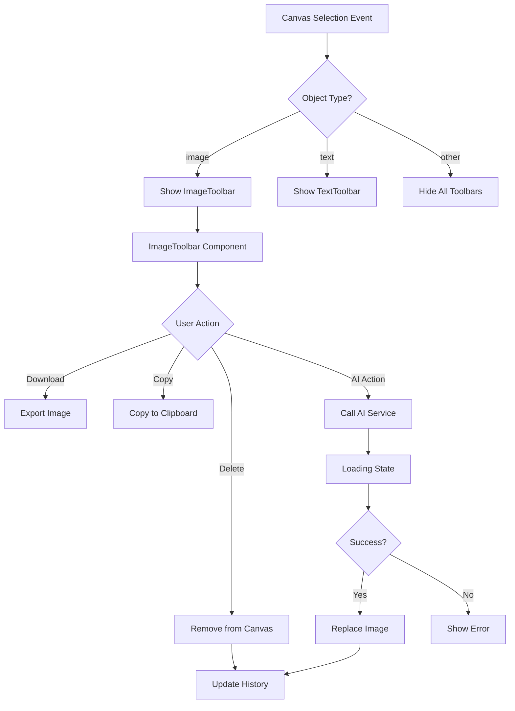

# Design Document: Image Toolbar

## Overview

本设计文档描述了 Fluxa 画布编辑器中图片浮动工具栏（Image Toolbar）的技术实现方案。该组件在用户选中图片时显示，提供图片编辑、AI 增强和导出等功能。

设计遵循现有 `TextToolbar` 组件的架构模式，确保代码一致性和可维护性。

## Architecture

### 组件层次结构

```
CanvasStage
├── SelectionInfo (显示选中元素信息)
├── QuickEditHint (快速编辑提示)
├── TextToolbar (文本工具栏 - 已存在)
├── ImageToolbar (图片工具栏 - 新增) ◄──
├── ContextMenu (右键菜单)
└── ZoomControls (缩放控制)
```

### 数据流



## Components and Interfaces

### ImageToolbar Component

```typescript
// src/components/canvas/ImageToolbar.tsx

export interface ImageToolbarProps {
  /** Screen X coordinate for positioning */
  x: number;
  /** Screen Y coordinate for positioning */
  y: number;
  /** Selected image width (for positioning calculations) */
  imageWidth: number;
  /** Selected image height (for positioning calculations) */
  imageHeight: number;
  /** Whether toolbar should appear below the image (edge case) */
  positionBelow?: boolean;
  /** Callback when download is clicked */
  onDownload: () => void;
  /** Callback when copy is clicked */
  onCopy: () => void;
  /** Callback when delete is clicked */
  onDelete: () => void;
  /** Callback when remove background is clicked */
  onRemoveBackground: () => Promise<void>;
  /** Callback when upscale is clicked */
  onUpscale: () => Promise<void>;
  /** Callback when erase is clicked */
  onErase: () => void;
  /** Callback when expand is clicked */
  onExpand: () => void;
  /** Callback for layer ordering */
  onBringToFront: () => void;
  onSendToBack: () => void;
  onBringForward: () => void;
  onSendBackward: () => void;
  /** Callback for lock/unlock */
  onToggleLock: () => void;
  /** Whether the image is locked */
  isLocked: boolean;
  /** Loading states for async operations */
  loadingStates: ImageToolbarLoadingStates;
  /** Optional className for styling */
  className?: string;
}

export interface ImageToolbarLoadingStates {
  removeBackground: boolean;
  upscale: boolean;
  erase: boolean;
  expand: boolean;
}

export interface ToolAction {
  id: string;
  icon: React.ComponentType<{ className?: string }>;
  label: string;
  onClick: () => void | Promise<void>;
  disabled?: boolean;
  loading?: boolean;
  badge?: string;
  group: 'primary' | 'ai' | 'more';
}
```

### ImageToolbarState in CanvasStage

```typescript
// Addition to CanvasStage component state

interface ImageToolbarState {
  x: number;
  y: number;
  imageWidth: number;
  imageHeight: number;
  positionBelow: boolean;
  isLocked: boolean;
}

// New state in CanvasStage
const [imageToolbarInfo, setImageToolbarInfo] = useState<ImageToolbarState | null>(null);
const [imageToolbarLoading, setImageToolbarLoading] = useState<ImageToolbarLoadingStates>({
  removeBackground: false,
  upscale: false,
  erase: false,
  expand: false,
});
```

### AI Service Integration

```typescript
// src/lib/api/imageProcessing.ts

export interface RemoveBackgroundParams {
  imageUrl: string;
  documentId: string;
}

export interface UpscaleParams {
  imageUrl: string;
  documentId: string;
  scale?: 2 | 4;
}

export interface InpaintParams {
  imageUrl: string;
  maskDataUrl: string;
  documentId: string;
  prompt?: string;
}

export interface OutpaintParams {
  imageUrl: string;
  documentId: string;
  direction: 'top' | 'bottom' | 'left' | 'right' | 'all';
  pixels: number;
  prompt?: string;
}

export interface ImageProcessingResult {
  jobId: string;
  resultUrl?: string;
  pointsDeducted?: number;
  remainingPoints?: number;
}

// API functions
export async function removeBackground(
  params: RemoveBackgroundParams,
  accessToken?: string
): Promise<ImageProcessingResult>;

export async function upscaleImage(
  params: UpscaleParams,
  accessToken?: string
): Promise<ImageProcessingResult>;

export async function inpaintImage(
  params: InpaintParams,
  accessToken?: string
): Promise<ImageProcessingResult>;

export async function outpaintImage(
  params: OutpaintParams,
  accessToken?: string
): Promise<ImageProcessingResult>;
```

## Data Models

### Tool Configuration

```typescript
// src/components/canvas/ImageToolbar.config.ts

import {
  Download,
  Eraser,
  Expand,
  ImageUp,
  Scissors,
  MoreHorizontal,
  Copy,
  Trash2,
  ArrowUpToLine,
  ArrowDownToLine,
  Lock,
  Unlock,
} from 'lucide-react';

export const IMAGE_TOOLBAR_TOOLS: ToolAction[] = [
  // Primary tools (always visible)
  {
    id: 'upscale',
    icon: ImageUp,
    label: 'image_toolbar.upscale',
    group: 'primary',
    badge: 'HD',
  },
  {
    id: 'removeBackground',
    icon: Scissors,
    label: 'image_toolbar.remove_background',
    group: 'ai',
  },
  {
    id: 'erase',
    icon: Eraser,
    label: 'image_toolbar.erase',
    group: 'ai',
  },
  {
    id: 'expand',
    icon: Expand,
    label: 'image_toolbar.expand',
    group: 'ai',
  },
  {
    id: 'download',
    icon: Download,
    label: 'image_toolbar.download',
    group: 'primary',
  },
  {
    id: 'more',
    icon: MoreHorizontal,
    label: 'image_toolbar.more',
    group: 'primary',
  },
];

export const MORE_MENU_ITEMS = [
  { id: 'copy', icon: Copy, label: 'image_toolbar.copy' },
  { id: 'delete', icon: Trash2, label: 'image_toolbar.delete' },
  { id: 'divider1', type: 'divider' },
  { id: 'bringToFront', icon: ArrowUpToLine, label: 'image_toolbar.bring_to_front' },
  { id: 'sendToBack', icon: ArrowDownToLine, label: 'image_toolbar.send_to_back' },
  { id: 'divider2', type: 'divider' },
  { id: 'toggleLock', icon: Lock, label: 'image_toolbar.lock' },
];
```

### i18n Keys

```typescript
// Additions to src/locales/zh-CN/editor.json
{
  "image_toolbar": {
    "upscale": "放大",
    "remove_background": "移除背景",
    "erase": "擦除",
    "expand": "扩展",
    "download": "下载",
    "more": "更多",
    "copy": "复制",
    "delete": "删除",
    "bring_to_front": "置于顶层",
    "send_to_back": "置于底层",
    "bring_forward": "上移一层",
    "send_backward": "下移一层",
    "lock": "锁定",
    "unlock": "解锁",
    "processing": "处理中...",
    "insufficient_points": "积分不足",
    "error_processing": "处理失败，请重试"
  }
}

// Additions to src/locales/en-US/editor.json
{
  "image_toolbar": {
    "upscale": "Upscale",
    "remove_background": "Remove Background",
    "erase": "Erase",
    "expand": "Expand",
    "download": "Download",
    "more": "More",
    "copy": "Copy",
    "delete": "Delete",
    "bring_to_front": "Bring to Front",
    "send_to_back": "Send to Back",
    "bring_forward": "Bring Forward",
    "send_backward": "Send Backward",
    "lock": "Lock",
    "unlock": "Unlock",
    "processing": "Processing...",
    "insufficient_points": "Insufficient Points",
    "error_processing": "Processing failed, please retry"
  }
}
```

## Correctness Properties

*A property is a characteristic or behavior that should hold true across all valid executions of a system—essentially, a formal statement about what the system should do. Properties serve as the bridge between human-readable specifications and machine-verifiable correctness guarantees.*

### Property 1: Selection Type Determines Toolbar Visibility

*For any* canvas object selection event, the ImageToolbar SHALL appear if and only if the selected object is a single image object (type === 'image').

**Validates: Requirements 1.1, 1.2, 1.3, 1.7**

### Property 2: Toolbar Positioning Follows Image

*For any* selected image at position (x, y) with dimensions (width, height) and viewport transform vpt, the ImageToolbar position SHALL be calculated as:
- screenX = x * vpt[0] + vpt[4] + (width * vpt[0]) / 2
- screenY = y * vpt[3] + vpt[5] - toolbarHeight (or + height * vpt[3] + offset if near top edge)

**Validates: Requirements 1.4, 1.5, 1.6**

### Property 3: Image Export Preserves Original Resolution

*For any* image export operation, the exported image SHALL have the same pixel dimensions as the original image source, regardless of canvas zoom level or scale transform.

**Validates: Requirements 3.1, 3.2**

### Property 4: Copy-Paste Round Trip

*For any* image object, copying and then pasting SHALL produce a new image object with identical visual properties (src, filters) but offset position.

**Validates: Requirements 4.1, 4.3**

### Property 5: Delete Operation Correctness

*For any* delete operation on a selected image, the image SHALL be removed from canvas, the toolbar SHALL disappear, and the operation SHALL be undoable.

**Validates: Requirements 5.1, 5.2, 5.3**

### Property 6: AI Operation State Machine

*For any* AI operation (removeBackground, upscale, erase, expand), the operation SHALL follow the state machine:
1. Initial → Loading (on click)
2. Loading → Success (on API success) → Image replaced, history updated
3. Loading → Error (on API failure) → Error shown, original preserved

**Validates: Requirements 6.1-6.5, 7.1-7.4, 8.1-8.6, 9.3-9.5**

### Property 7: Points Validation Before AI Operations

*For any* AI operation, if user points are insufficient, the operation SHALL be blocked and an insufficient points message SHALL be displayed without calling the API.

**Validates: Requirements 6.6, 7.6, 8.7, 9.7**

### Property 8: Keyboard Shortcuts Consistency

*For any* selected image, keyboard shortcuts (Delete, Cmd+C, Cmd+D) SHALL trigger the same actions as their toolbar button equivalents.

**Validates: Requirements 12.1, 12.2, 12.3**

### Property 9: Menu Action Execution

*For any* menu item selection in the "More" dropdown, the corresponding action SHALL be executed and the menu SHALL close.

**Validates: Requirements 10.1, 10.4**

## Error Handling

### Error Types

```typescript
export enum ImageToolbarErrorCode {
  EXPORT_FAILED = 'EXPORT_FAILED',
  COPY_FAILED = 'COPY_FAILED',
  AI_PROCESSING_FAILED = 'AI_PROCESSING_FAILED',
  INSUFFICIENT_POINTS = 'INSUFFICIENT_POINTS',
  NETWORK_ERROR = 'NETWORK_ERROR',
  INVALID_IMAGE = 'INVALID_IMAGE',
}

export interface ImageToolbarError {
  code: ImageToolbarErrorCode;
  message: string;
  details?: Record<string, unknown>;
}
```

### Error Handling Strategy

1. **Export Errors**: Display toast notification, log error, no state change
2. **Copy Errors**: Display toast notification, log error
3. **AI Processing Errors**: 
   - Display error toast with retry option
   - Restore original image if partially modified
   - Reset loading state
4. **Insufficient Points**: 
   - Display points dialog with upgrade option
   - Do not call API
5. **Network Errors**: 
   - Display retry toast
   - Implement exponential backoff for retries

### Error Recovery

```typescript
// Error recovery hook
function useImageToolbarErrorRecovery() {
  const handleError = useCallback((error: ImageToolbarError, originalImage?: fabric.Image) => {
    // Log error
    console.error('[ImageToolbar]', error.code, error.message, error.details);
    
    // Show user feedback
    toast.error(getErrorMessage(error.code));
    
    // Restore original if needed
    if (originalImage && error.code === ImageToolbarErrorCode.AI_PROCESSING_FAILED) {
      restoreOriginalImage(originalImage);
    }
  }, []);
  
  return { handleError };
}
```

## Testing Strategy

### Unit Tests

Unit tests will cover:
- Component rendering with various props
- Button click handlers
- Loading state display
- Error state display
- Menu open/close behavior
- Position calculation edge cases

### Property-Based Tests

Property-based tests using `fast-check` will validate:
- **Property 1**: Selection type → toolbar visibility mapping
- **Property 2**: Position calculation correctness across viewport transforms
- **Property 3**: Export resolution preservation
- **Property 4**: Copy-paste equivalence
- **Property 5**: Delete operation atomicity
- **Property 6**: AI operation state transitions
- **Property 8**: Keyboard shortcut equivalence

### Test Configuration

```typescript
// tests/canvas/ImageToolbar.test.ts
import { describe, it, expect } from 'vitest';
import * as fc from 'fast-check';

// Minimum 100 iterations per property test
const PBT_CONFIG = { numRuns: 100 };

// Arbitraries for test data generation
const positionArb = fc.record({
  x: fc.float({ min: -1000, max: 2000 }),
  y: fc.float({ min: -1000, max: 2000 }),
});

const dimensionsArb = fc.record({
  width: fc.float({ min: 10, max: 2000 }),
  height: fc.float({ min: 10, max: 2000 }),
});

const viewportTransformArb = fc.tuple(
  fc.float({ min: 0.1, max: 5 }), // zoom
  fc.constant(0),
  fc.constant(0),
  fc.float({ min: 0.1, max: 5 }), // zoom
  fc.float({ min: -2000, max: 2000 }), // panX
  fc.float({ min: -2000, max: 2000 }), // panY
);
```

### Integration Tests

Integration tests will verify:
- ImageToolbar integration with CanvasStage
- AI service API calls
- History (undo/redo) integration
- i18n integration

## File Structure

```
src/components/canvas/
├── ImageToolbar.tsx           # Main component
├── ImageToolbar.config.ts     # Tool configuration
├── ImageToolbar.types.ts      # Type definitions
├── index.ts                   # Updated exports

src/lib/api/
├── imageProcessing.ts         # AI image processing API client

src/locales/
├── zh-CN/
│   └── editor.json            # Updated with image_toolbar keys
├── en-US/
│   └── editor.json            # Updated with image_toolbar keys

tests/canvas/
├── ImageToolbar.test.ts       # Unit and property tests
├── ImageToolbar.integration.test.ts  # Integration tests
```
