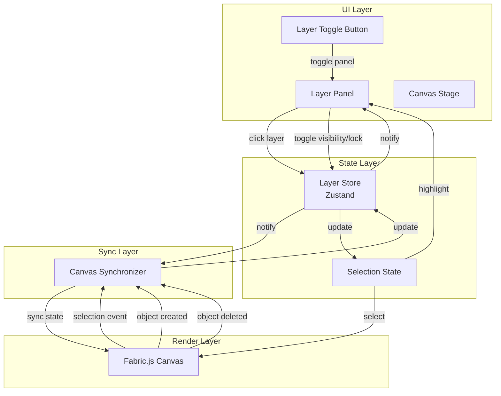
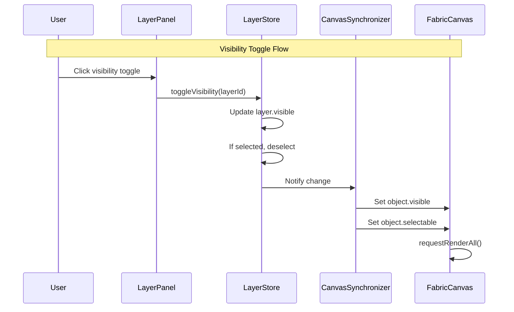
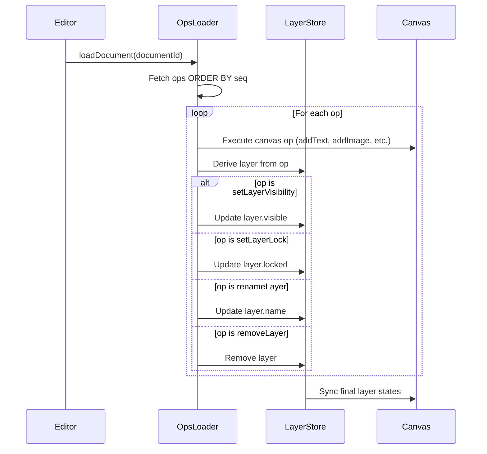

# Design Document: Layer System

## Overview

Fluxa 图层系统为画布引入业务级图层抽象，实现画布元素与图层的一一映射。核心设计原则是"图层优先"：所有业务逻辑基于 Layer 状态，Fabric.js Canvas 仅作为渲染实现。

本设计遵循以下架构原则：
- **单向数据流**：Layer Store → Canvas Object（永不反向读取）
- **单一选中源**：Selection State 作为唯一真相源
- **语义操作**：所有用户操作先改 Layer，再同步 Canvas

## Architecture

### Current Code Analysis

当前 `CanvasStage.tsx` (925+ 行) 职责过重，包含：
- Canvas 初始化和生命周期
- 工具模式处理 (select, rectangle, text, pencil)
- 缩放/平移控制
- 选中状态管理
- 历史记录 (undo/redo)
- 导出功能
- 键盘快捷键
- 上下文菜单
- 图层信息提取

### Proposed Refactoring

为了支持图层系统，建议将 CanvasStage 拆分为以下模块：

```
src/lib/canvas/
├── ops.types.ts          # Op 类型定义 (已有)
├── opsExecutor.ts        # Op 执行器 (已有)
├── layer.types.ts        # Layer 类型定义 (新增)
├── layerStore.ts         # Layer Store (新增)
├── canvasSynchronizer.ts # Canvas 同步器 (新增)
└── export.ts             # 导出功能 (已有)

src/components/canvas/
├── CanvasStage.tsx       # 主画布组件 (简化)
├── ContextMenu.tsx       # 右键菜单 (已有)
├── SelectionInfo.tsx     # 选中信息 (已有)
└── index.ts              # 导出 (已有)

src/components/layer/     # 新增目录
├── LayerPanel.tsx        # 图层面板
├── LayerItem.tsx         # 图层列表项
├── LayerPanelToggle.tsx  # 面板切换按钮
└── index.ts              # 导出
```

### Target Architecture



### Key Design Decisions

1. **Layer Store 独立于 OpsExecutor**
   - OpsExecutor 负责执行 AI 生成的 Op
   - Layer Store 负责管理图层业务状态
   - 两者通过 Canvas Object ID 关联

2. **Canvas Synchronizer 作为中间层**
   - 监听 Layer Store 变化，同步到 Canvas
   - 监听 Canvas 事件，更新 Layer Store
   - 确保单向数据流：Layer → Canvas

3. **Selection State 内置于 Layer Store**
   - `selectedLayerId` 作为 Layer Store 的一部分
   - 避免多个 store 之间的同步问题

## Components and Interfaces

### 1. Layer Data Model

```typescript
/**
 * Layer type enumeration
 * Currently supports rect, text, and image, extensible for future types
 */
type LayerType = 'rect' | 'text' | 'image';

/**
 * Core Layer interface
 * Represents a single canvas element's business semantics
 */
interface Layer {
  /** Stable unique identifier, persists across sessions */
  id: string;
  
  /** Display name, auto-generated based on type and order */
  name: string;
  
  /** Layer type, determines icon and behavior */
  type: LayerType;
  
  /** Visibility state - hidden layers are invisible and unselectable */
  visible: boolean;
  
  /** Lock state - locked layers cannot be selected or modified */
  locked: boolean;
  
  /** Reference to corresponding Fabric.js object ID */
  canvasObjectId: string;
}
```

### 2. Layer Store (Zustand)

```typescript
interface LayerState {
  /** All layers, keyed by layer ID */
  layers: Map<string, Layer>;
  
  /** Currently selected layer ID, null if none */
  selectedLayerId: string | null;
  
  /** Layer panel visibility state */
  isPanelVisible: boolean;
  
  /** Counter for auto-naming (per type) */
  nameCounters: Record<LayerType, number>;
}

interface LayerActions {
  /** Create a new layer for a canvas object */
  createLayer: (type: LayerType, canvasObjectId: string) => Layer;
  
  /** Remove a layer by ID */
  removeLayer: (layerId: string) => void;
  
  /** Toggle layer visibility */
  toggleVisibility: (layerId: string) => void;
  
  /** Toggle layer lock state */
  toggleLock: (layerId: string) => void;
  
  /** Rename a layer */
  renameLayer: (layerId: string, name: string) => void;
  
  /** Set selected layer (from panel or canvas) */
  setSelectedLayer: (layerId: string | null) => void;
  
  /** Toggle panel visibility */
  togglePanel: () => void;
  
  /** Get layer by canvas object ID */
  getLayerByCanvasObjectId: (canvasObjectId: string) => Layer | undefined;
  
  /** Get all layers as ordered array */
  getLayersArray: () => Layer[];
}

type LayerStore = LayerState & LayerActions;
```

### 3. Canvas Synchronizer

负责 Layer Store 与 Fabric.js Canvas 之间的双向状态同步。这是一个关键的中间层，确保 Layer 优先的数据流。

```typescript
interface CanvasSynchronizerConfig {
  canvas: fabric.Canvas;
  layerStore: LayerStore;
}

class CanvasSynchronizer {
  private canvas: fabric.Canvas;
  private layerStore: LayerStore;
  private isUpdating: boolean = false; // 防止循环更新
  
  constructor(config: CanvasSynchronizerConfig);
  
  /** 初始化：绑定 Canvas 事件监听 */
  initialize(): void;
  
  /** 清理：移除事件监听 */
  dispose(): void;
  
  // === Layer → Canvas 同步 ===
  
  /** 同步单个图层的可见性到 Canvas */
  syncVisibility(layerId: string): void;
  
  /** 同步单个图层的锁定状态到 Canvas */
  syncLockState(layerId: string): void;
  
  /** 同步选中状态到 Canvas */
  syncSelection(layerId: string | null): void;
  
  /** 批量同步所有图层状态 */
  syncAllLayers(): void;
  
  // === Canvas → Layer 同步 ===
  
  /** 处理 Canvas 对象创建事件 */
  private handleObjectAdded(e: fabric.TEvent): void;
  
  /** 处理 Canvas 对象删除事件 */
  private handleObjectRemoved(e: fabric.TEvent): void;
  
  /** 处理 Canvas 选中事件 */
  private handleSelectionCreated(e: fabric.TEvent): void;
  
  /** 处理 Canvas 取消选中事件 */
  private handleSelectionCleared(): void;
  
  // === 工具方法 ===
  
  /** 根据 Layer ID 查找 Canvas Object */
  findCanvasObject(layerId: string): fabric.FabricObject | null;
  
  /** 根据 Canvas Object 查找 Layer */
  findLayerByCanvasObject(obj: fabric.FabricObject): Layer | null;
}
```

#### 同步流程示例

```typescript
// Layer Store 订阅变化，触发同步
layerStore.subscribe((state, prevState) => {
  // 检测可见性变化
  for (const [id, layer] of state.layers) {
    const prevLayer = prevState.layers.get(id);
    if (prevLayer && prevLayer.visible !== layer.visible) {
      synchronizer.syncVisibility(id);
    }
    if (prevLayer && prevLayer.locked !== layer.locked) {
      synchronizer.syncLockState(id);
    }
  }
  
  // 检测选中变化
  if (state.selectedLayerId !== prevState.selectedLayerId) {
    synchronizer.syncSelection(state.selectedLayerId);
  }
});
```

### 4. Layer Panel Component

```typescript
interface LayerPanelProps {
  /** Callback when layer is clicked for selection */
  onLayerSelect: (layerId: string) => void;
  
  /** Callback when visibility is toggled */
  onVisibilityToggle: (layerId: string) => void;
  
  /** Callback when lock is toggled */
  onLockToggle: (layerId: string) => void;
  
  /** Callback when layer is renamed */
  onRename: (layerId: string, name: string) => void;
}
```

### 5. Layer Item Component

```typescript
interface LayerItemProps {
  /** Layer data */
  layer: Layer;
  
  /** Whether this layer is selected */
  isSelected: boolean;
  
  /** Callback when layer is clicked for selection */
  onSelect: () => void;
  
  /** Callback when visibility is toggled */
  onVisibilityToggle: () => void;
  
  /** Callback when lock is toggled */
  onLockToggle: () => void;
  
  /** Callback when layer is renamed (double-click to edit) */
  onRename: (name: string) => void;
}
```

### 6. Layer Panel Toggle Component

```typescript
interface LayerPanelToggleProps {
  /** Current panel visibility state */
  isVisible: boolean;
  
  /** Callback when toggle is clicked */
  onToggle: () => void;
}
```

## Data Models

### Layer ID Generation

使用稳定的 UUID 格式确保跨会话持久性：

```typescript
const generateLayerId = (): string => {
  return `layer-${crypto.randomUUID()}`;
};
```

### Layer Name Generation

基于类型和创建顺序自动生成：

```typescript
const generateLayerName = (type: LayerType, counter: number): string => {
  const typeNames: Record<LayerType, string> = {
    rect: '矩形',
    text: '文字',
    image: '图片',
  };
  return `${typeNames[type]} ${counter}`;
};
```

### State Synchronization Flow



## Correctness Properties

*A property is a characteristic or behavior that should hold true across all valid executions of a system—essentially, a formal statement about what the system should do. Properties serve as the bridge between human-readable specifications and machine-verifiable correctness guarantees.*

### Property 1: Layer Data Integrity

*For any* Layer object in the Layer Store, it SHALL have all required properties (id, name, type, visible, locked, canvasObjectId) with correct types, and the id SHALL be unique across all layers.

**Validates: Requirements 1.1, 1.2, 1.3**

### Property 2: Layer Default Values

*For any* newly created Layer, visible SHALL be true and locked SHALL be false.

**Validates: Requirements 1.5**

### Property 3: Layer Auto-Creation

*For any* canvas object creation event (rect, text, or image), a corresponding Layer SHALL be created in the Layer Store with matching type.

**Validates: Requirements 2.1, 2.2, 2.3, 2.4**

### Property 4: Layer Auto-Deletion

*For any* canvas object deletion event, the corresponding Layer SHALL be removed from the Layer Store.

**Validates: Requirements 2.5**

### Property 5: Visibility Toggle Round-Trip

*For any* Layer, toggling visibility twice SHALL return the Layer to its original visible state.

**Validates: Requirements 4.1, 4.4**

### Property 6: Visibility Canvas Sync

*For any* Layer with visible=false, its corresponding Canvas Object SHALL have visible=false and selectable=false.

**Validates: Requirements 4.2, 4.3, 4.5**

### Property 7: Lock Toggle Round-Trip

*For any* Layer, toggling lock twice SHALL return the Layer to its original locked state.

**Validates: Requirements 5.1, 5.4**

### Property 8: Lock Canvas Sync

*For any* Layer with locked=true, its corresponding Canvas Object SHALL have selectable=false and evented=false.

**Validates: Requirements 5.2, 5.3, 5.5**

### Property 9: Selection Cleanup on State Change

*For any* selected Layer, if it becomes hidden OR locked, the Selection State SHALL immediately deselect it.

**Validates: Requirements 4.6, 5.6**

### Property 10: Bidirectional Selection Sync

*For any* selection change (from canvas or panel), the Selection State SHALL be consistent: if a Layer is selected in the store, its Canvas Object SHALL be selected, and vice versa.

**Validates: Requirements 6.1, 6.2, 6.3, 6.6**

### Property 11: Selection Prevention for Hidden/Locked Layers

*For any* Layer that is hidden OR locked, attempting to select it (via panel click) SHALL NOT change the Selection State.

**Validates: Requirements 6.4, 6.5**

### Property 12: Layer Store as Source of Truth

*For any* state inconsistency between Layer Store and Canvas Object, the Layer Store state SHALL be applied to the Canvas Object to restore consistency.

**Validates: Requirements 7.1, 7.3, 7.4**

### Property 13: Panel Toggle Round-Trip

*For any* panel state, toggling the panel twice SHALL return it to its original visibility state.

**Validates: Requirements 3.7**

### Property 14: Ops Replay Layer Reconstruction

*For any* sequence of ops containing layer creation ops (addRect, addText, addImage), replaying the ops SHALL produce the same set of layers with matching IDs.

**Validates: Requirements 8.3, 8.4, 8.7**

### Property 15: Visibility Persistence Round-Trip

*For any* Layer, toggling visibility, persisting as op, then replaying ops SHALL restore the same visibility state.

**Validates: Requirements 8.1, 8.5**

### Property 16: Lock Persistence Round-Trip

*For any* Layer, toggling lock, persisting as op, then replaying ops SHALL restore the same lock state.

**Validates: Requirements 8.2, 8.5**

### Property 17: Layer Name Persistence Round-Trip

*For any* Layer with a custom name, persisting as renameLayer op, then replaying ops SHALL restore the same name.

**Validates: Requirements 9.1, 9.2**

### Property 18: RemoveLayer Op Consistency

*For any* Layer that is removed, the removeLayer op SHALL cause the layer to be absent after ops replay.

**Validates: Requirements 8.6**

### Property 19: Manual Element Persistence

*For any* manually created element (rect or text), the system SHALL persist a corresponding op (addRect or addText) to the ops table, and replaying ops SHALL recreate the same element.

**Validates: Requirements 2.6, 2.7**

## Error Handling

### Canvas Object Not Found

当 Layer 引用的 Canvas Object 不存在时：
- 记录警告日志
- 从 Layer Store 中移除该 Layer
- 不影响其他 Layer 的正常操作

### Invalid Layer State

当 Layer 状态无效时（如缺少必要属性）：
- 使用默认值修复
- 记录错误日志
- 继续正常操作

### Selection Conflict

当 Canvas 和 Panel 同时触发选中时：
- 以最后一个事件为准
- 使用 debounce 防止抖动

## Layer Persistence

### New Op Types

为支持图层状态持久化，需要扩展 Op 类型：

```typescript
/**
 * addRect op
 * Persists user-drawn rectangle to ops table
 */
export interface AddRectOp extends BaseOp {
  type: 'addRect';
  payload: {
    id: string;
    x: number;
    y: number;
    width: number;
    height: number;
    fill?: string;
    stroke?: string;
    strokeWidth?: number;
  };
}

/**
 * setLayerVisibility op
 * Persists layer visibility state
 */
export interface SetLayerVisibilityOp extends BaseOp {
  type: 'setLayerVisibility';
  payload: {
    id: string;      // Layer ID (same as canvas object ID)
    visible: boolean;
  };
}

/**
 * setLayerLock op
 * Persists layer lock state
 */
export interface SetLayerLockOp extends BaseOp {
  type: 'setLayerLock';
  payload: {
    id: string;      // Layer ID
    locked: boolean;
  };
}

/**
 * renameLayer op
 * Persists custom layer name
 */
export interface RenameLayerOp extends BaseOp {
  type: 'renameLayer';
  payload: {
    id: string;      // Layer ID
    name: string;
  };
}
```

### Ops Replay Flow

页面加载时，通过重放 ops 重建图层状态：



### Layer Derivation from Ops

从现有 ops 推导图层列表的逻辑：

```typescript
interface LayerDerivationResult {
  layers: Map<string, Layer>;
  nameCounters: Record<LayerType, number>;
}

function deriveLayersFromOps(ops: Op[]): LayerDerivationResult {
  const layers = new Map<string, Layer>();
  const nameCounters: Record<LayerType, number> = { rect: 0, text: 0, image: 0 };
  
  for (const op of ops) {
    switch (op.type) {
      case 'addRect':
        nameCounters.rect++;
        layers.set(op.payload.id, {
          id: op.payload.id,
          name: `矩形 ${nameCounters.rect}`,
          type: 'rect',
          visible: true,
          locked: false,
          canvasObjectId: op.payload.id,
        });
        break;
        
      case 'addText':
        nameCounters.text++;
        layers.set(op.payload.id, {
          id: op.payload.id,
          name: `文字 ${nameCounters.text}`,
          type: 'text',
          visible: true,
          locked: false,
          canvasObjectId: op.payload.id,
        });
        break;
        
      case 'addImage':
        nameCounters.image++;
        layers.set(op.payload.id, {
          id: op.payload.id,
          name: `图片 ${nameCounters.image}`,
          type: 'image',
          visible: true,
          locked: false,
          canvasObjectId: op.payload.id,
        });
        break;
        
      case 'setLayerVisibility':
        const layerV = layers.get(op.payload.id);
        if (layerV) layerV.visible = op.payload.visible;
        break;
        
      case 'setLayerLock':
        const layerL = layers.get(op.payload.id);
        if (layerL) layerL.locked = op.payload.locked;
        break;
        
      case 'renameLayer':
        const layerR = layers.get(op.payload.id);
        if (layerR) layerR.name = op.payload.name;
        break;
        
      case 'removeLayer':
        layers.delete(op.payload.id);
        break;
    }
  }
  
  return { layers, nameCounters };
}
```

### Persistence Integration

Layer Store 需要与 ops 持久化集成：

```typescript
interface LayerPersistenceActions {
  /** Persist visibility change as op */
  persistVisibility: (layerId: string, visible: boolean) => Promise<void>;
  
  /** Persist lock change as op */
  persistLock: (layerId: string, locked: boolean) => Promise<void>;
  
  /** Persist name change as op */
  persistName: (layerId: string, name: string) => Promise<void>;
  
  /** Initialize layers from ops */
  initializeFromOps: (ops: Op[]) => void;
}
```

## Testing Strategy

### Unit Tests

使用 Vitest 进行单元测试：

1. **Layer Store Tests**
   - 测试 createLayer 生成正确的 Layer 对象
   - 测试 toggleVisibility 正确更新状态
   - 测试 toggleLock 正确更新状态
   - 测试 removeLayer 正确删除 Layer
   - 测试 setSelectedLayer 正确更新选中状态

2. **Canvas Synchronizer Tests**
   - 测试 syncVisibility 正确设置 Canvas Object 属性
   - 测试 syncLockState 正确设置 Canvas Object 属性
   - 测试 selectCanvasObject 正确选中对象

3. **Component Tests**
   - 测试 LayerPanel 正确渲染所有 Layer
   - 测试 LayerPanelToggle 正确切换面板

### Property-Based Tests

使用 fast-check 进行属性测试，每个测试运行 100+ 次迭代：

1. **Layer Data Integrity** (Property 1)
   - 生成随机 Layer 数据，验证所有属性存在且类型正确
   - 生成多个 Layer，验证 ID 唯一性

2. **Visibility/Lock Round-Trip** (Properties 5, 7)
   - 生成随机 Layer，执行 toggle 操作两次，验证状态恢复

3. **Selection Cleanup** (Property 9)
   - 生成随机选中的 Layer，执行 hide/lock，验证自动取消选中

4. **Bidirectional Selection Sync** (Property 10)
   - 生成随机选中操作序列，验证 Store 和 Canvas 状态一致

5. **Selection Prevention** (Property 11)
   - 生成随机 hidden/locked Layer，尝试选中，验证选中失败

### Test Configuration

```typescript
// vitest.config.ts
export default defineConfig({
  test: {
    // Property tests run 100+ iterations
    testTimeout: 30000,
  },
});
```

每个属性测试必须包含注释引用设计文档中的属性：

```typescript
// Feature: layer-system, Property 1: Layer Data Integrity
// Validates: Requirements 1.1, 1.2, 1.3
```
