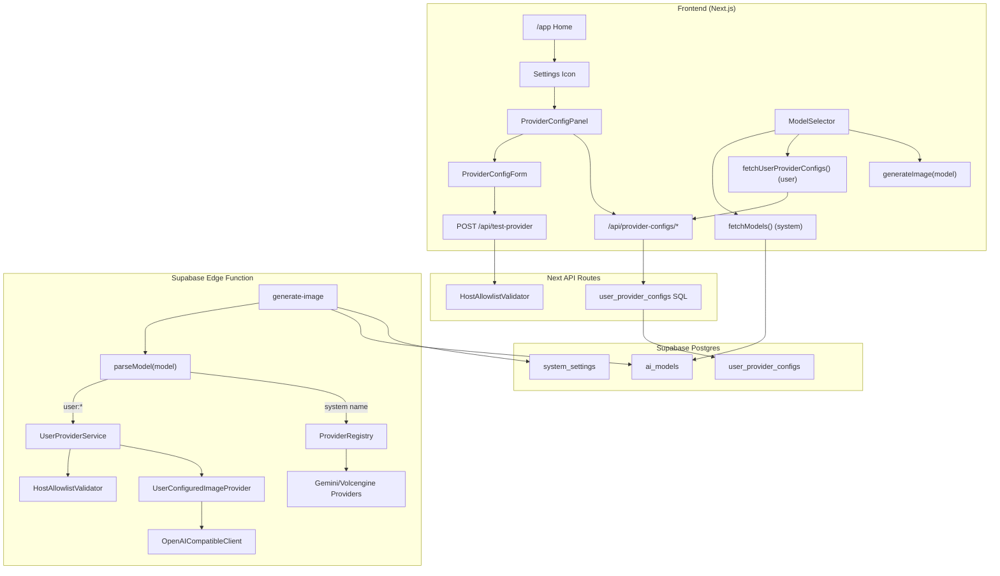

# Design Document: Model Config Settings

## Overview

本功能支持用户在 Fluxa 中配置自定义图像 Provider。Gemini 继续作为系统内置默认模型，用户可新增多个 Volcengine / OpenAI-Compatible 配置并在编辑器中选择使用。

本版设计已固化以下产品决策：
- **模型标识策略**：系统模型继续传原始 `model_name`；仅用户模型使用 `user:{configId}`
- **配置数量策略**：同一用户允许多个可配置 Provider 记录（含 `volcengine` 与 `openai-compatible`）
- **计费策略**：用户 BYOK 模型不扣平台积分（`pointsDeducted=0`），并返回 `remainingPoints=实时余额`
- **积分前置校验策略**：用户 BYOK 模型在前后端都绕过“积分不足”拦截
- **网络安全策略**：第三方 API URL 仅允许严格白名单 `host:port`
- **白名单故障策略**：白名单配置缺失/空时 fail-closed
- **错误码策略**：`user:{id}` 失效场景统一错误码 `USER_PROVIDER_CONFIG_INVALID`
- **错误状态码策略**：`user:{id}` 失效场景统一返回 HTTP 400
- **保存一致性策略**：配置保存前服务端执行最终重校验（防 TOCTOU）
- **重校验超时策略**：save 前最终重校验超时即拒绝保存且不重试

---

## 关键设计决策

| 决策 | 选择 | 理由 |
|------|------|------|
| API Key 存储 | `api_key_encrypted` + `api_key_last4` | 前端展示不依赖解密，降低泄露面 |
| 模型标识 | 系统：`model_name`；用户：`user:{configId}` | 对现有 ops/chat 链路改动最小，避免全量协议迁移 |
| Custom 配置数量 | 支持多条 `volcengine` / `openai-compatible` | 满足多账号/多区域/多模型并行使用 |
| BYOK 计费 | 用户模型不扣平台积分 | 与用户决策一致，减少“重复收费”认知负担 |
| Endpoint 安全 | 严格白名单 `host:port`（仅精确匹配） | 降低 SSRF / 内网探测风险 |
| 白名单规范化 | `https` 未显式端口视作 `:443` 后匹配 | 兼容用户输入 URL 习惯，避免误判 |
| BYOK 限流 | 不新增 BYOK 专用限流策略 | 与产品决策一致，避免影响体验 |
| BYOK 积分前置校验 | 前后端都绕过“积分不足”拦截 | BYOK 不依赖平台积分，不应误拦截 |
| 编辑留空 key | 允许复用旧 key，但保存前强制重测 | 防止 URL/模型变更导致失效配置入库 |
| 保存防 TOCTOU | 持久化前服务端执行最终重校验 | 避免 test 与 save 之间配置漂移导致脏数据 |
| BYOK 交易记录 | 不写 0 分 point transaction | 减少无意义账务噪音 |
| 白名单读取 | `system_settings` 白名单读取采用 60s 短缓存 | 平衡实时性和性能 |
| 白名单故障策略 | allowlist 缺失或空列表时 fail-closed | 安全优先，避免误放行 |
| fail-closed 运维 | 记录 error + 触发监控告警（仅监控通道） | 保障可观测与可恢复，不依赖 admin banner |
| 编辑重测入参 | `apiKey` 留空编辑时必须携带 `configId` | 服务端可按 `user_id + configId` 读取旧 key 并重测 |
| 无效用户模型审计 | 先创建 job，再置 `failed` | 保证失败链路有可追踪 job_id |
| 无效用户模型错误码 | 使用统一错误码 `USER_PROVIDER_CONFIG_INVALID` | 降低前端分支复杂度 |
| 无效用户模型 HTTP 状态 | 固定 HTTP 400 | 统一前端异常处理与埋点聚合 |
| BYOK 返回字段 | `pointsDeducted=0` + `remainingPoints=实时余额` | 前端余额展示与账务语义一致 |
| 余额读取口径 | `remainingPoints` 按请求实时查库 | 避免并发请求导致余额展示漂移 |
| 重校验超时处理 | 超时立即失败，不自动重试 | 避免延迟放大与不确定状态写入 |
| 默认模型 | DB `ai_models.is_default` 为真源，运行时回退 `gemini-3-pro-image-preview` | 消除硬编码漂移 |

---

## Architecture



---

## 数据流

### 1) 配置保存流

1. 用户在 `ProviderConfigForm` 输入配置
2. 先调用 `/api/test-provider` 做联通与权限验证（含 host 白名单校验）
3. 验证通过后调用 `/api/provider-configs` 保存配置
4. 服务端在最终落库前执行一次重校验（allowlist + key 连通性）以防 TOCTOU
5. 若重校验超时则立即拒绝保存（fail-fast，不自动重试）
6. 校验通过后写入 `api_key_encrypted` 和 `api_key_last4`
7. 前端仅拿到 `api_key_masked`

### 2) 模型列表流

1. 前端加载系统模型：`fetchModels()`（现有）
2. 前端加载用户模型：`fetchUserProviderConfigs()`（新增）
3. 合并后输出：
   - 系统项 `value = model.name`
   - 用户项 `value = user:${config.id}`

### 3) 图像生成流

1. 前端将 `model` 传给 `generate-image`
2. Edge 解析：
   - `model` 以 `user:` 开头 → 走用户配置链路
   - 否则 → 走系统 ProviderRegistry
3. 用户配置链路需二次校验 host 白名单
4. 用户模型成功生成时返回 `pointsDeducted=0` 且 `remainingPoints=实时余额`
5. 用户模型前后端均绕过“积分不足”前置拦截

---

## Components and Interfaces

### 1. ProviderConfigPanel

位置：`src/components/settings/ProviderConfigPanel.tsx`

```typescript
interface ProviderConfigPanelProps {
  open: boolean;
  onOpenChange: (open: boolean) => void;
}
```

- Gemini section（只读）
- Volcengine section（可配）
- Custom OpenAI-Compatible section（列表 + 新增配置）
- 每条配置支持编辑/启用禁用/删除

### 2. ProviderConfigForm

位置：`src/components/settings/ProviderConfigForm.tsx`

```typescript
interface ProviderConfigInput {
  provider: 'volcengine' | 'openai-compatible';
  apiKey?: string; // 编辑时可空，表示保留旧 key
  apiUrl: string;
  modelName: string;
  displayName: string;
}

interface ProviderConfigFormProps {
  configId?: string;
  initialValue?: Partial<ProviderConfigInput>;
  onSave: (input: ProviderConfigInput) => Promise<void>;
  onDelete?: () => Promise<void>;
  onToggleEnabled?: (enabled: boolean) => Promise<void>;
}
```

### 3. ProviderConfigService（前端）

位置：`src/lib/api/provider-configs.ts`

```typescript
export type UserModelIdentifier = `user:${string}`;
export type ModelValue = string | UserModelIdentifier; // system model_name | user:configId

interface UserProviderConfig {
  id: string;
  provider: string;
  api_url: string;
  model_name: string;
  display_name: string;
  is_enabled: boolean;
  api_key_masked: string;
  model_identifier: UserModelIdentifier;
  created_at: string;
  updated_at: string;
}

async function fetchUserProviderConfigs(): Promise<UserProviderConfig[]>;
async function createProviderConfig(input: ProviderConfigInput): Promise<UserProviderConfig>;
async function updateProviderConfig(id: string, input: ProviderConfigInput): Promise<UserProviderConfig>;
async function updateProviderEnabled(id: string, isEnabled: boolean): Promise<void>;
async function deleteProviderConfig(id: string): Promise<void>;
```

### 4. Next API Routes

位置：
- `src/app/api/provider-configs/route.ts` (`GET`, `POST`)
- `src/app/api/provider-configs/[id]/route.ts` (`PATCH`, `DELETE`)
- `src/app/api/test-provider/route.ts` (`POST`)

#### `/api/test-provider` 行为

1. 校验参数完整性（编辑且 `apiKey` 为空时，必须传 `configId`）
2. 解析并校验 URL `host:port` 必须命中白名单
3. 先测 `/models`，其次 `/v1/models`
4. 若不支持 list models，再 fallback 最小 chat completion
5. 编辑场景若 `apiKey` 为空，服务端按 `user_id + configId` 读取该配置现有 key 并强制执行重测
6. 不调用图片生成端点（避免保存配置时触发额外成本）
7. 若白名单来源不可用或为空，直接 fail-closed 拒绝验证
8. 统一返回 `{ success, error? }`

#### `/api/provider-configs`（`POST`/`PATCH`）保存保护

1. 在最终持久化前，服务端必须执行一次重校验（allowlist + 认证可用性）
2. 重校验失败则拒绝保存，即使稍早 `test-provider` 成功
3. 编辑场景 `apiKey` 为空时，重校验同样按 `user_id + configId` 读取旧 key
4. 重校验超时时立即拒绝保存，且不做自动重试

### 5. Edge Function 用户配置服务

位置：`supabase/functions/_shared/services/user-provider.ts`

```typescript
interface UserProviderRecord {
  id: string;
  user_id: string;
  provider: string;
  api_key: string; // decrypt only inside edge runtime
  api_url: string;
  model_name: string;
  display_name: string;
  is_enabled: boolean;
}

class UserProviderService {
  constructor(private supabase: SupabaseClient, private encryptionKey: string);
  async getConfigById(userId: string, configId: string): Promise<UserProviderRecord | null>;
}
```

### 6. generate-image 模型解析

位置：`supabase/functions/generate-image/index.ts`

```typescript
function isUserModelIdentifier(model: string): model is `user:${string}` {
  return model.startsWith('user:');
}

function getUserConfigId(model: `user:${string}`): string {
  return model.slice('user:'.length);
}
```

执行策略：
- `user:{id}`：查当前用户 + 启用配置 + 白名单校验，命中则用 `UserConfiguredImageProvider`
- 系统模型名：按现有 registry
- `user:{id}` 未命中/已禁用/已删除：先创建 generation job，再置 `failed`（用于审计）并返回 `USER_PROVIDER_CONFIG_INVALID`（HTTP 400），不自动回退系统模型
- 若白名单来源不可用或为空：fail-closed，拒绝第三方 provider 生成请求
- 用户模型跳过积分不足前置拦截，并在响应中返回按请求实时查库的 `remainingPoints`

### 7. UserConfiguredImageProvider

位置：`supabase/functions/_shared/providers/user-configured-provider.ts`

```typescript
class UserConfiguredImageProvider implements ImageProvider {
  readonly name: string;
  readonly capabilities: ProviderCapabilities;
  constructor(private client: OpenAICompatibleClient, private config: UserProviderRecord);
  async generate(request: ProviderRequest): Promise<ImageResult>;
  validateRequest(request: ProviderRequest): ValidationResult;
}
```

---

## Data Models

### `user_provider_configs` 表

```sql
CREATE TABLE IF NOT EXISTS user_provider_configs (
  id UUID PRIMARY KEY DEFAULT gen_random_uuid(),
  user_id UUID NOT NULL REFERENCES auth.users(id) ON DELETE CASCADE,
  provider TEXT NOT NULL, -- 'volcengine' | 'openai-compatible'
  api_key_encrypted BYTEA NOT NULL,
  api_key_last4 TEXT NOT NULL DEFAULT '',
  api_url TEXT NOT NULL,
  model_name TEXT NOT NULL,
  display_name TEXT NOT NULL,
  is_enabled BOOLEAN NOT NULL DEFAULT true,
  created_at TIMESTAMPTZ NOT NULL DEFAULT now(),
  updated_at TIMESTAMPTZ NOT NULL DEFAULT now(),

  UNIQUE (user_id, model_name)
);

CREATE INDEX idx_user_provider_configs_user_enabled
  ON user_provider_configs(user_id, is_enabled);

ALTER TABLE user_provider_configs ENABLE ROW LEVEL SECURITY;

CREATE POLICY "Users can view own configs"
  ON user_provider_configs FOR SELECT
  USING (auth.uid() = user_id);

CREATE POLICY "Users can insert own configs"
  ON user_provider_configs FOR INSERT
  WITH CHECK (auth.uid() = user_id);

CREATE POLICY "Users can update own configs"
  ON user_provider_configs FOR UPDATE
  USING (auth.uid() = user_id)
  WITH CHECK (auth.uid() = user_id);

CREATE POLICY "Users can delete own configs"
  ON user_provider_configs FOR DELETE
  USING (auth.uid() = user_id);
```

### 安全视图（前端只读）

```sql
CREATE OR REPLACE VIEW user_provider_configs_safe
WITH (security_invoker = true) AS
SELECT
  id,
  user_id,
  provider,
  api_url,
  model_name,
  display_name,
  is_enabled,
  created_at,
  updated_at,
  CASE WHEN api_key_last4 = '' THEN '****' ELSE '****' || api_key_last4 END AS api_key_masked
FROM user_provider_configs;
```

### 白名单配置

建议来源（按优先级）：
1. `system_settings` 键 `provider_host_allowlist`（JSON array）
2. Edge/Next 环境变量 `PROVIDER_HOST_ALLOWLIST`（兜底，逗号分隔）

维护方式：
- 仅管理员通过 SQL / Supabase 控制台维护白名单
- 不提供应用内白名单管理 API

严格校验规则：
- 仅 `https://`
- `host:port` 必须精确命中白名单（不支持通配符/子域模糊匹配）
- 规范化规则：若 URL 为 `https` 且未显式端口，按 `:443` 比较
- 禁止 IP literal、`localhost`、私网/链路本地/metadata 地址
- 读取策略：`system_settings.provider_host_allowlist` 采用 60s 短缓存；缓存失效后刷新
- 若 `system_settings` 与 env 均不可用或解析后为空列表，运行时必须 fail-closed（拒绝 test/generation）
- fail-closed 触发时，必须记录 error 日志并通过监控系统上报告警（不依赖应用内 admin banner）

### 默认模型迁移

```sql
BEGIN;

UPDATE ai_models SET is_default = false WHERE type = 'image';

UPDATE ai_models
SET is_default = true
WHERE type = 'image' AND name = 'gemini-3-pro-image-preview';

DO $$
DECLARE c INT;
BEGIN
  SELECT COUNT(*) INTO c FROM ai_models WHERE type='image' AND is_default=true;
  IF c <> 1 THEN
    RAISE EXCEPTION 'Expected exactly one default image model, got %', c;
  END IF;
END $$;

COMMIT;
```

---

## 兼容性与迁移要点

1. 现有系统模型仍使用原始模型名（不加前缀），避免影响 `generate-ops`
2. 仅用户模型在前端传 `user:{configId}`
3. 若历史状态中 `selectedModel` 是纯模型名，不需迁移
4. 若用户配置被删除但前端仍缓存 `user:{id}`，后端先创建 job 再置 failed（审计）并返回结构化错误提示刷新
5. 前端收到该错误后保持当前模型选择，不自动切回系统模型
6. 上述失效场景统一使用错误码 `USER_PROVIDER_CONFIG_INVALID`

---

## Error Handling

### 前端

| 场景 | 处理 |
|------|------|
| 保存失败 | Toast + 保留表单输入 |
| Test 失败 | 显示可读错误，不允许保存 |
| BYOK 模型触发积分检查 | 跳过“积分不足”弹窗/拦截，直接发起请求 |
| Host 不在白名单 | 明确提示“该 host:port 不在允许列表” |
| 白名单配置缺失/为空 | fail-closed 拒绝验证，提示联系管理员恢复白名单 |
| 删除失败 | Toast + 重试入口 |

### Edge Function

| 场景 | 处理 |
|------|------|
| `user:{id}` 不存在/禁用/删除 | 先创建 job 再置 failed（审计）并返回错误码 `USER_PROVIDER_CONFIG_INVALID`（HTTP 400） |
| `user:{id}` 失效导致生成失败 | 保持当前选择，提示用户到设置修复/启用配置 |
| 用户 URL 不在白名单 | 直接拒绝，不发外部请求 |
| 白名单配置缺失/为空 | fail-closed，拒绝外部调用并记录配置错误 + 监控告警（无 admin banner 依赖） |
| save 前最终重校验超时 | 立即拒绝保存，不自动重试 |
| 编辑时留空 key 且重测失败 | 拒绝保存，提示检查 URL/模型/权限 |
| 第三方返回错误 | 记录 status/message 到 job output（脱敏） |
| 解密失败 | 记录错误并返回 failed |

---

## Testing Strategy

### 框架

- Unit/Integration: Vitest
- Property-based: fast-check

### Property Tests（每项至少 `numRuns: 100`）

| Property | 说明 |
|----------|------|
| P1 | Config round-trip（加密存储 + mask） |
| P2 | RLS user isolation |
| P3 | Update-by-id 语义不新增脏数据 |
| P4 | Exactly one default image model |
| P5 | 表单必填校验 |
| P6 | Test request fail prevents save |
| P7 | API key masking format |
| P8 | `user:{id}` 路由正确解析 |
| P9 | Gemini always visible |
| P10 | enabled 过滤正确 |
| P11 | toggle round-trip |
| P12 | delete removes config |
| P13 | 状态标签映射正确 |
| P14 | 用户模型标识传递正确 |
| P15 | Host allowlist strict reject |
| P16 | BYOK returns `pointsDeducted=0` |
| P17 | Invalid `user:{id}` follows create-job-then-fail audit path with code `USER_PROVIDER_CONFIG_INVALID` |
| P18 | `https` endpoint default port normalizes to `:443` before allowlist match |
| P19 | Invalid `user:{id}` failure does not auto-switch selected model |
| P20 | Edit-with-empty-key still performs mandatory re-test |
| P21 | BYOK path does not create point transaction records |
| P22 | Missing/empty allowlist triggers fail-closed for test/generation |
| P23 | Edit-with-empty-key request without `configId` is rejected |
| P24 | BYOK model bypasses insufficient-points precheck on client and edge |
| P25 | Save endpoint performs final revalidation before persistence (TOCTOU guard) |
| P26 | BYOK `remainingPoints` comes from fresh per-request balance read |
| P27 | Invalid `user:{id}` returns HTTP 400 with code `USER_PROVIDER_CONFIG_INVALID` |
| P28 | Final save revalidation timeout fails save immediately without retry |
| P29 | fail-closed emits monitoring alerts without requiring admin banner |

### Unit/Integration Tests

- `ProviderConfigPanel` / `ProviderConfigForm`
- `/api/provider-configs` 与 `/api/test-provider`
- `generate-image`：系统模型与 `user:{id}` 双路径
- BYOK 模型返回 `pointsDeducted=0` + `remainingPoints` 来自实时余额读取
- BYOK 模型前后端均绕过积分不足前置拦截
- `user:{id}` 失效场景统一错误码 `USER_PROVIDER_CONFIG_INVALID`
- `user:{id}` 失效场景统一 HTTP 400
- save 前最终重校验超时立即拒绝且不重试
