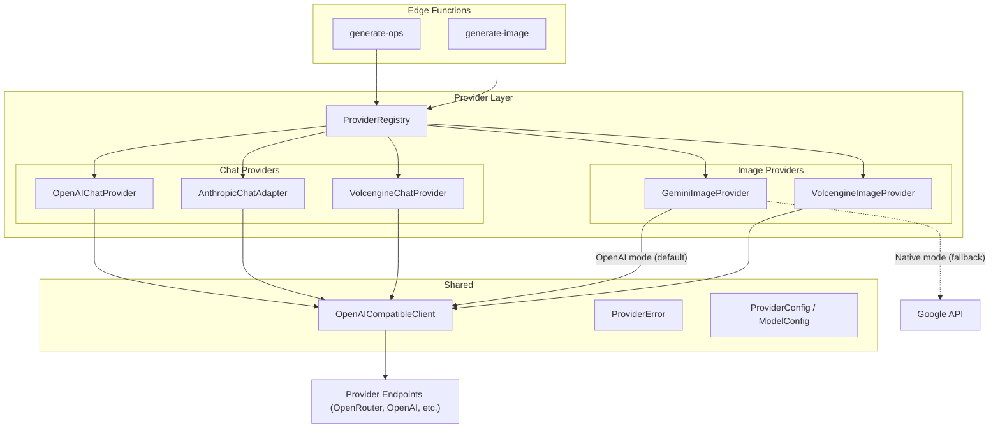
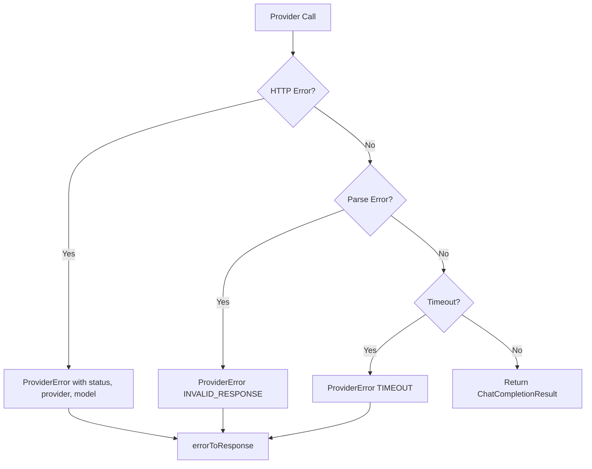

# Design Document: OpenAI-Compatible Providers

## Overview

This design refactors all AI provider integrations in Fluxa's Supabase Edge Functions to use a unified OpenAI-compatible API format. The core idea is to introduce a layered provider architecture:

1. A **unified client** that speaks OpenAI-format HTTP requests/responses
2. **Provider adapters** that translate between the unified format and provider-native formats (only needed for non-OpenAI-compatible providers like Anthropic and Gemini native image API)
3. A **Provider Registry** that maps model names to provider instances

Currently, `generate-ops/index.ts` has inline provider-specific branching (OpenAI, Anthropic, Volcengine) with different request building and response parsing per provider. The `generate-image/index.ts` uses if/else chains to instantiate provider classes. The legacy `gemini-provider.ts` duplicates the newer `providers/gemini.ts`.

After refactoring, both Edge Functions will resolve providers through the registry and call them through uniform interfaces, eliminating inline branching and duplication.

## Architecture



Key design decisions:

1. **OpenAI-compatible providers (OpenAI, Volcengine chat, Volcengine image) use the shared client directly** — no adapter needed since their APIs already speak OpenAI format.
2. **Anthropic chat requires an adapter** — translates OpenAI-format messages to Anthropic's `system` + `messages` format, and translates `content[0].text` responses back to `choices[0].message.content`.
3. **Gemini image supports dual mode** — The `GeminiImageProvider` has a `mode: 'openai' | 'native'` config option. In `openai` mode (default), it uses the `OpenAICompatibleClient` to call `/v1/images/generations` (e.g., via OpenRouter). In `native` mode, it falls back to the existing `generateContent` API. This allows using OpenRouter as a proxy for Gemini image generation while keeping the native API as a fallback.
4. **The ProviderRegistry is the single entry point** — both Edge Functions resolve providers through it, eliminating all inline model config maps and if/else chains.

## Components and Interfaces

### 1. ChatProvider Interface

```typescript
interface ChatCompletionOptions {
  temperature?: number;
  maxTokens?: number;
  responseFormat?: { type: 'json_object' | 'text' };
}

interface ChatMessage {
  role: 'system' | 'user' | 'assistant';
  content: string | Array<{ type: 'text'; text: string }>;
}

interface ChatCompletionResult {
  content: string;
  finishReason?: string;
  usage?: { promptTokens: number; completionTokens: number; totalTokens: number };
}

interface ChatProvider {
  readonly name: string;
  chatCompletion(messages: ChatMessage[], options?: ChatCompletionOptions): Promise<ChatCompletionResult>;
}
```

### 2. ImageProvider Interface (existing, unchanged)

The existing `ImageProvider` interface in `_shared/providers/types.ts` is already well-designed and remains unchanged:

```typescript
interface ImageProvider {
  readonly name: string;
  readonly capabilities: ProviderCapabilities;
  generate(request: ProviderRequest): Promise<ImageResult>;
  validateRequest(request: ProviderRequest): ValidationResult;
}
```

### 3. OpenAICompatibleClient

A shared HTTP client that handles OpenAI-format request/response for both chat and image generation:

```typescript
interface OpenAIClientConfig {
  apiUrl: string;
  apiKey: string;
  defaultHeaders?: Record<string, string>;
}

interface ImageGenerationRequest {
  model: string;
  prompt: string;
  n?: number;
  size?: string;
  response_format?: 'url' | 'b64_json';
}

interface ImageGenerationResponse {
  data: Array<{
    url?: string;
    b64_json?: string;
  }>;
}

class OpenAICompatibleClient {
  constructor(private config: OpenAIClientConfig) {}

  async chatCompletion(
    model: string,
    messages: ChatMessage[],
    options?: ChatCompletionOptions
  ): Promise<ChatCompletionResult> { /* ... */ }

  async imageGeneration(
    request: ImageGenerationRequest
  ): Promise<ImageGenerationResponse> { /* ... */ }
}
```

This client is used by `OpenAIChatProvider`, `VolcengineChatProvider`, `VolcengineImageProvider`, and `GeminiImageProvider` (in OpenAI mode). It handles:
- Building the `{ model, messages, temperature, max_tokens }` request body for chat
- Building the `{ model, prompt, n, size }` request body for image generation
- Sending POST requests with `Authorization: Bearer <key>` header
- Parsing the `{ choices: [{ message: { content } }] }` chat response
- Parsing the `{ data: [{ url?, b64_json? }] }` image response
- Throwing `ProviderError` on HTTP errors or parse failures

### 4. AnthropicChatAdapter

Wraps the `OpenAICompatibleClient` pattern but translates to/from Anthropic's native format:

```typescript
class AnthropicChatAdapter implements ChatProvider {
  readonly name = 'anthropic';

  async chatCompletion(messages: ChatMessage[], options?: ChatCompletionOptions): Promise<ChatCompletionResult> {
    // 1. Extract system message from messages array
    // 2. Build Anthropic request: { model, system, messages (without system), max_tokens }
    // 3. Set headers: x-api-key, anthropic-version
    // 4. Parse Anthropic response: content[0].text → ChatCompletionResult.content
  }
}
```

### 5. ProviderRegistry

```typescript
interface ProviderEntry {
  type: 'chat' | 'image';
  provider: ChatProvider | ImageProvider;
}

class ProviderRegistry {
  private chatProviders: Map<string, () => ChatProvider>;
  private imageProviders: Map<string, () => ImageProvider>;

  registerChatModel(modelName: string, factory: () => ChatProvider): void;
  registerImageModel(modelName: string, factory: () => ImageProvider): void;
  getChatProvider(modelName: string): ChatProvider;
  getImageProvider(modelName: string): ImageProvider;
  isSupported(modelName: string): boolean;
  getSupportedModels(): { chat: string[]; image: string[] };
}
```

The registry uses lazy factory functions so providers are only instantiated when needed (API keys are read at call time, not at registration time).

### 6. Provider Implementations

| Provider | Type | Strategy |
|----------|------|----------|
| `OpenAIChatProvider` | chat | Direct OpenAI client call |
| `AnthropicChatAdapter` | chat | Translate to/from Anthropic format |
| `VolcengineChatProvider` | chat | Direct OpenAI client call (already compatible) |
| `GeminiImageProvider` | image | Dual mode: OpenAI-compatible (default) or native Gemini API |
| `VolcengineImageProvider` | image | Existing implementation (already uses OpenAI-ish format) |

### 7. GeminiImageProvider Dual-Mode Design

The `GeminiImageProvider` supports two API modes controlled by a `mode` config option:

```typescript
interface GeminiImageProviderConfig {
  mode: 'openai' | 'native';  // default: 'openai'
  supabase: SupabaseClient;
  modelName: GeminiModelName;
}

class GeminiImageProvider implements ImageProvider {
  readonly name: string;
  readonly capabilities: ProviderCapabilities;
  private mode: 'openai' | 'native';

  constructor(config: GeminiImageProviderConfig) {
    this.mode = config.mode;
    // ...
  }

  async generate(request: ProviderRequest): Promise<ImageResult> {
    if (this.mode === 'openai') {
      return this.generateViaOpenAI(request);
    }
    return this.generateViaNative(request);
  }

  private async generateViaOpenAI(request: ProviderRequest): Promise<ImageResult> {
    // Uses OpenAICompatibleClient to call /v1/images/generations
    // e.g., via OpenRouter: https://openrouter.ai/api/v1/images/generations
    // Request: { model: "google/gemini-...", prompt, n: 1, size: "1024x1024" }
    // Response: { data: [{ url?, b64_json? }] }
  }

  private async generateViaNative(request: ProviderRequest): Promise<ImageResult> {
    // Existing Gemini native API logic (generateContent with multimodal parts)
    // Fallback for when OpenAI-compatible endpoint is unavailable
  }
}
```

**Mode selection**: Controlled by `GEMINI_IMAGE_API_MODE` environment variable (`openai` or `native`), defaulting to `openai`. In OpenAI mode, the provider reads `GEMINI_IMAGE_API_URL` (e.g., `https://openrouter.ai/api`) and `GEMINI_IMAGE_API_KEY` (e.g., OpenRouter API key) for the endpoint configuration.

## Data Models

### ProviderConfig

```typescript
interface ProviderConfig {
  /** Provider identifier */
  name: string;
  /** Base API URL */
  apiUrl: string;
  /** Authentication type */
  authType: 'bearer' | 'api-key-header';
  /** Environment variable name for the API key */
  apiKeyEnvVar: string;
  /** Additional default headers */
  defaultHeaders?: Record<string, string>;
  /** API mode: 'openai' for OpenAI-compatible endpoints, 'native' for provider-native API */
  apiMode?: 'openai' | 'native';
}
```

### ModelConfig

```typescript
interface ModelConfig {
  /** Display model name (used as key in registry) */
  name: string;
  /** Provider-specific model ID sent in API requests */
  modelId: string;
  /** Provider this model belongs to */
  providerName: string;
  /** Model type */
  type: 'chat' | 'image';
}
```

### ChatCompletionRequest (internal, sent to OpenAI-compatible endpoints)

```typescript
interface ChatCompletionRequest {
  model: string;
  messages: Array<{
    role: 'system' | 'user' | 'assistant';
    content: string | Array<{ type: 'text'; text: string }>;
  }>;
  temperature?: number;
  max_tokens?: number;
  response_format?: { type: 'json_object' | 'text' };
}
```

### ChatCompletionResponse (internal, received from OpenAI-compatible endpoints)

```typescript
interface ChatCompletionResponse {
  choices: Array<{
    message: {
      role: string;
      content: string;
    };
    finish_reason?: string;
  }>;
  usage?: {
    prompt_tokens: number;
    completion_tokens: number;
    total_tokens: number;
  };
}
```

### AnthropicRequest (internal, used by adapter)

```typescript
interface AnthropicRequest {
  model: string;
  system?: string;
  messages: Array<{ role: 'user' | 'assistant'; content: string }>;
  max_tokens: number;
}
```

### AnthropicResponse (internal, used by adapter)

```typescript
interface AnthropicResponse {
  content: Array<{ type: 'text'; text: string }>;
  stop_reason?: string;
  usage?: { input_tokens: number; output_tokens: number };
}
```


## Correctness Properties

*A property is a characteristic or behavior that should hold true across all valid executions of a system — essentially, a formal statement about what the system should do. Properties serve as the bridge between human-readable specifications and machine-verifiable correctness guarantees.*

### Property 1: OpenAI client request format

*For any* set of valid ChatMessage arrays and ChatCompletionOptions, the OpenAI_Compatible_Client SHALL produce a request body containing `model`, `messages`, and any specified optional fields (`temperature`, `max_tokens`, `response_format`) in the correct OpenAI format.

**Validates: Requirements 1.2**

### Property 2: OpenAI client response parsing

*For any* valid OpenAI-format response JSON containing `choices[0].message.content`, the OpenAI_Compatible_Client SHALL extract the content string into a `ChatCompletionResult` with the correct `content`, `finishReason`, and `usage` fields.

**Validates: Requirements 1.3**

### Property 3: Anthropic adapter translation preserves content

*For any* set of OpenAI-format ChatMessages (including a system message), the AnthropicChatAdapter SHALL translate them to Anthropic format such that: (a) the system message becomes the `system` field, (b) non-system messages are preserved in order, and (c) when a mock Anthropic response with content `[{type: "text", text: T}]` is returned, the adapter produces a ChatCompletionResult with `content === T`.

**Validates: Requirements 1.4**

### Property 4: OpenAI-compatible providers pass messages unchanged

*For any* OpenAI-compatible chat provider (OpenAI, Volcengine) and any valid ChatMessage array, the provider SHALL pass the messages to the OpenAI_Compatible_Client without modification to message roles or content.

**Validates: Requirements 1.5, 1.6**

### Property 5: Registry register-then-retrieve

*For any* model name and provider factory, after registering the model in the Provider_Registry, calling `getChatProvider(modelName)` or `getImageProvider(modelName)` SHALL return a provider instance created by that factory.

**Validates: Requirements 3.1, 3.2**

### Property 6: Registry rejects unregistered models

*For any* string that has not been registered in the Provider_Registry, calling `getChatProvider` or `getImageProvider` SHALL throw a ProviderError with error code `MODEL_NOT_SUPPORTED`.

**Validates: Requirements 3.3**

### Property 7: ProviderConfig validation catches missing fields

*For any* object that is missing one or more required ProviderConfig fields (`name`, `apiUrl`, `authType`, `apiKeyEnvVar`), the validation function SHALL return an error result listing all missing fields. The optional `apiMode` field SHALL not cause validation failure when absent.

**Validates: Requirements 3.5, 3.6, 4.3**

### Property 8: ProviderConfig serialization round trip

*For any* valid ProviderConfig object (including those with optional `apiMode` field), serializing to JSON and deserializing back SHALL produce an object deeply equal to the original.

**Validates: Requirements 4.1, 4.2**

### Property 9: HTTP errors produce ProviderError with required fields

*For any* HTTP error status code (4xx or 5xx), when the OpenAI_Compatible_Client receives such a response, it SHALL throw a ProviderError containing the status code, provider name, and error message.

**Validates: Requirements 8.1**

### Property 10: Unparseable responses produce ProviderError

*For any* response body that is not valid JSON or does not contain the expected `choices` or `data` structure, the OpenAI_Compatible_Client SHALL throw a ProviderError with error code `INVALID_RESPONSE`.

**Validates: Requirements 8.2**

### Property 11: Gemini dual-mode dispatches to correct API

*For any* valid ProviderRequest and any mode (`'openai'` or `'native'`), the GeminiImageProvider SHALL: (a) in `openai` mode, send a request to the `/v1/images/generations` endpoint with `{ model, prompt, n, size }` format and parse the `{ data: [{ url?, b64_json? }] }` response; (b) in `native` mode, send a request to the Gemini `generateContent` endpoint with multimodal content parts format.

**Validates: Requirements 2.2, 2.3, 2.4**

### Property 12: OpenAI image generation request format

*For any* valid image generation request (model, prompt, optional size), the OpenAI_Compatible_Client `imageGeneration` method SHALL produce a request body containing `model`, `prompt`, and any specified optional fields (`n`, `size`, `response_format`) in the correct OpenAI images format, and parse the `{ data: [...] }` response correctly.

**Validates: Requirements 2.2**

## Error Handling

The error handling strategy builds on the existing `AppError` hierarchy in `_shared/errors/index.ts`.

### Error Flow



### Error Types

The existing `ProviderError` class is extended with additional context:

```typescript
class ProviderError extends AppError {
  readonly code = ERROR_CODES.PROVIDER_ERROR;
  readonly statusCode = 502;

  constructor(
    message: string,
    public readonly providerCode?: string,
    details?: unknown,
    public readonly providerName?: string,
    public readonly modelName?: string,
    public readonly httpStatus?: number
  ) {
    super(message, details);
  }
}
```

### Error Scenarios

| Scenario | Error Code | HTTP Status | Details |
|----------|-----------|-------------|---------|
| API key missing | `MISSING_API_KEY` | 500 | Provider name |
| HTTP error from provider | `API_ERROR` | 502 | Status code, response body |
| Unparseable response | `INVALID_RESPONSE` | 502 | Raw response text |
| Request timeout | `TIMEOUT` | 504 | Provider name, timeout duration |
| Unknown model | `MODEL_NOT_SUPPORTED` | 400 | Model name |

## Testing Strategy

### Testing Framework

- **Vitest** for test runner
- **fast-check** for property-based testing
- Tests in `tests/providers/` directory

### Dual Testing Approach

**Property-Based Tests** (fast-check, minimum 100 iterations each):
- Test universal properties across generated inputs
- Each property test references its design document property
- Tag format: `Feature: openai-compatible-providers, Property N: description`

**Unit Tests**:
- Specific examples for integration points (Edge Function → Registry → Provider)
- Edge cases: empty messages, missing API keys, timeout scenarios
- Backward compatibility: known request/response pairs from existing behavior

### Test Organization

```
tests/
└── providers/
    ├── openai-client.test.ts        # Properties 1, 2, 9, 10, 12
    ├── anthropic-adapter.test.ts    # Property 3
    ├── chat-providers.test.ts       # Property 4
    ├── provider-registry.test.ts    # Properties 5, 6
    ├── provider-config.test.ts      # Properties 7, 8
    ├── gemini-image-provider.test.ts # Property 11
    └── integration.test.ts          # Example tests for backward compat
```

### Property Test Configuration

Each property test runs with `{ numRuns: 100 }` and is annotated:

```typescript
/**
 * Feature: openai-compatible-providers, Property 5: Registry register-then-retrieve
 * Validates: Requirements 3.1, 3.2
 */
describe('Property 5: Registry register-then-retrieve', () => {
  it('should return the registered provider for any model name', () => {
    fc.assert(
      fc.property(fc.string({ minLength: 1 }), (modelName) => {
        // register, then retrieve, verify same instance
      }),
      { numRuns: 100 }
    );
  });
});
```

### Mocking Strategy

- Mock `fetch` for all HTTP calls to provider APIs
- Mock `Deno.env.get` for API key retrieval
- Mock Supabase client for `system_settings` queries (Gemini API host)
- No real API calls in tests
