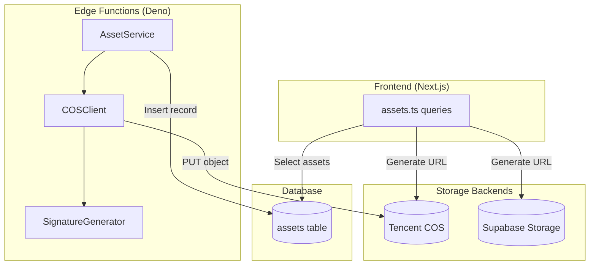
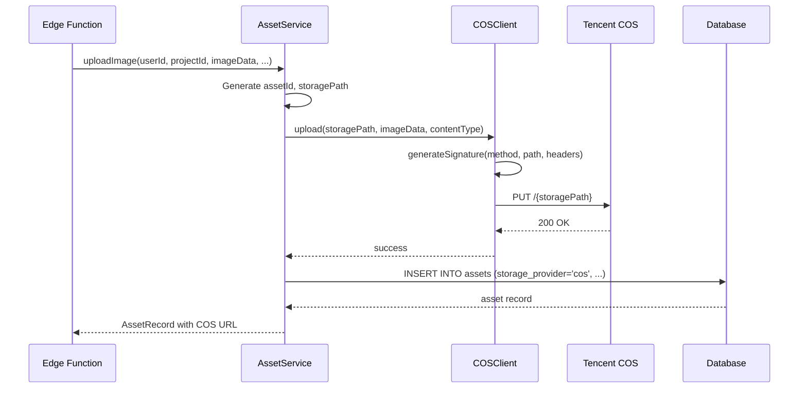

# Design Document: Tencent COS Storage Migration

## Overview

This design describes the migration of Fluxa's storage backend from Supabase Storage to Tencent Cloud COS. The implementation uses COS REST API directly (no SDK) since Edge Functions run on Deno runtime. The design maintains backward compatibility with existing Supabase Storage assets while routing all new uploads to COS.

Key design decisions:
1. **REST API over SDK**: Deno runtime in Edge Functions doesn't support the COS Node.js SDK, so we implement direct REST API calls with signature generation
2. **Storage Provider Field**: Add `storage_provider` column to `assets` table to distinguish between storage backends
3. **Environment-based Configuration**: All COS credentials and settings via environment variables
4. **Minimal Code Changes**: Modify only `AssetService` and `assets.ts` query file

## Architecture



### Request Flow



## Components and Interfaces

### COSClient

A new class responsible for COS REST API interactions.

```typescript
interface COSConfig {
  secretId: string;
  secretKey: string;
  bucket: string;
  region: string;
}

interface COSUploadOptions {
  contentType: string;
  contentLength: number;
}

class COSClient {
  constructor(config: COSConfig);
  
  /**
   * Upload an object to COS
   * @param key - Object key (storage path)
   * @param data - Raw data as ArrayBuffer
   * @param options - Upload options including content type
   * @returns Promise resolving to public URL
   * @throws COSError on failure
   */
  async upload(key: string, data: ArrayBuffer, options: COSUploadOptions): Promise<string>;
  
  /**
   * Generate public URL for an object
   * @param key - Object key (storage path)
   * @returns Public URL string
   */
  getPublicUrl(key: string): string;
}
```

### SignatureGenerator

Handles COS authorization signature generation following Tencent's signature algorithm.

```typescript
interface SignatureParams {
  method: string;
  path: string;
  headers: Record<string, string>;
  signTime: number;
  expireTime: number;
}

class SignatureGenerator {
  constructor(secretId: string, secretKey: string);
  
  /**
   * Generate COS authorization signature
   * @param params - Signature parameters
   * @returns Authorization header value
   */
  generate(params: SignatureParams): string;
}
```

### Updated AssetService

Modified to use COSClient instead of Supabase Storage.

```typescript
class AssetService {
  constructor(
    private supabase: SupabaseClient,
    private cosClient: COSClient
  );
  
  /**
   * Upload image to COS and create asset record
   * Now uses COS instead of Supabase Storage
   */
  async uploadImage(
    userId: string,
    projectId: string,
    imageData: ArrayBuffer,
    contentType: string,
    metadata: AssetMetadata
  ): Promise<AssetRecord>;
  
  /**
   * Get public URL - delegates to COSClient
   */
  getPublicUrl(storagePath: string): string;
}
```

### Frontend URL Generation

Updated `fetchProjectAssets` to handle both storage providers.

```typescript
function getAssetUrl(asset: AssetRow): string {
  if (asset.storage_provider === 'cos') {
    return `https://${COS_BUCKET}.cos.${COS_REGION}.myqcloud.com/${asset.storage_path}`;
  }
  // Legacy Supabase Storage
  return `${SUPABASE_URL}/storage/v1/object/public/assets/${asset.storage_path}`;
}
```

## Data Models

### Database Schema Changes

Add `storage_provider` column to `assets` table:

```sql
ALTER TABLE assets 
ADD COLUMN storage_provider TEXT NOT NULL DEFAULT 'supabase';

-- Update constraint to allow only valid values
ALTER TABLE assets 
ADD CONSTRAINT assets_storage_provider_check 
CHECK (storage_provider IN ('supabase', 'cos'));

-- Comment for documentation
COMMENT ON COLUMN assets.storage_provider IS 'Storage backend: supabase (legacy) or cos (new)';
```

### Environment Variables

**Edge Functions (Supabase Secrets):**
- `COS_SECRET_ID` - Tencent Cloud API SecretId
- `COS_SECRET_KEY` - Tencent Cloud API SecretKey
- `COS_BUCKET` - COS bucket name (e.g., `fluxa-assets-1234567890`)
- `COS_REGION` - COS region (e.g., `ap-shanghai`)

**Frontend (.env):**
- `NEXT_PUBLIC_COS_BUCKET` - COS bucket name (public)
- `NEXT_PUBLIC_COS_REGION` - COS region (public)

### COS Signature Format

Tencent COS uses a specific signature format:

```
Authorization: q-sign-algorithm=sha1
              &q-ak=<SecretId>
              &q-sign-time=<StartTime>;<EndTime>
              &q-key-time=<StartTime>;<EndTime>
              &q-header-list=<HeaderList>
              &q-url-param-list=<UrlParamList>
              &q-signature=<Signature>
```

Where:
- `StartTime`/`EndTime`: Unix timestamps for signature validity
- `HeaderList`: Lowercase header names to sign (e.g., `content-type;host`)
- `UrlParamList`: URL parameter names to sign (empty for PUT)
- `Signature`: HMAC-SHA1 of the string to sign

### AssetRecord Type Update

```typescript
interface AssetRecord {
  id: string;
  projectId: string;
  userId: string;
  storagePath: string;
  storageProvider: 'supabase' | 'cos';  // New field
  publicUrl: string;
  mimeType: string;
  sizeBytes: number;
  dimensions?: { width: number; height: number };
}
```

### Error Types

```typescript
type COSErrorCode = 
  | 'COS_AUTH_FAILED'      // 403 response
  | 'COS_BUCKET_NOT_FOUND' // 404 response
  | 'COS_SERVER_ERROR'     // 5xx response
  | 'COS_NETWORK_ERROR'    // Network failure
  | 'COS_CONFIG_ERROR';    // Missing config

class COSError extends Error {
  constructor(
    message: string,
    public code: COSErrorCode,
    public statusCode?: number,
    public requestId?: string
  );
}
```


## Correctness Properties

*A property is a characteristic or behavior that should hold true across all valid executions of a system—essentially, a formal statement about what the system should do. Properties serve as the bridge between human-readable specifications and machine-verifiable correctness guarantees.*

### Property 1: Configuration Loading

*For any* set of valid COS environment variables (COS_SECRET_ID, COS_SECRET_KEY, COS_BUCKET, COS_REGION), creating a COSClient SHALL result in a client configured with those exact values.

**Validates: Requirements 1.1**

### Property 2: Missing Configuration Error

*For any* subset of required COS environment variables that is incomplete, attempting to create a COSClient SHALL throw a configuration error that identifies the missing variable(s).

**Validates: Requirements 1.2**

### Property 3: Credentials Not Exposed

*For any* error thrown by COSClient or AssetService, the error message and any logged output SHALL NOT contain the COS_SECRET_KEY value.

**Validates: Requirements 1.3, 5.5**

### Property 4: Signature Format Validation

*For any* valid signature parameters (method, path, headers, timestamps), the generated signature SHALL:
- Start with `q-sign-algorithm=sha1`
- Contain `q-ak=` followed by the SecretId
- Contain `q-sign-time=` and `q-key-time=` with valid Unix timestamp ranges
- Contain `q-header-list=` with lowercase header names
- End with `q-signature=` followed by a 40-character hex string

**Validates: Requirements 2.2, 2.3**

### Property 5: COS URL Construction

*For any* valid bucket name, region, and storage path, the constructed COS URL SHALL match the pattern `https://{bucket}.cos.{region}.myqcloud.com/{path}` and be a valid HTTPS URL.

**Validates: Requirements 3.1, 4.1, 4.4**

### Property 6: Request Headers Inclusion

*For any* upload request with a given MIME type, the request SHALL include:
- A `Content-Type` header matching the MIME type
- An `Authorization` header matching the signature format from Property 4
- A `Host` header matching `{bucket}.cos.{region}.myqcloud.com`

**Validates: Requirements 3.2, 3.3**

### Property 7: Storage Path Format

*For any* valid userId (UUID), projectId (UUID), and file extension (png/jpg), the generated storage path SHALL match the format `{userId}/{projectId}/{assetId}.{ext}` where assetId is also a valid UUID.

**Validates: Requirements 3.4**

### Property 8: Upload Creates Record

*For any* successful COS upload, an asset record SHALL be created in the database with:
- The correct storage_path
- storage_provider = 'cos'
- The correct user_id and project_id
- A valid public URL

**Validates: Requirements 3.5, 6.4**

### Property 9: Upload Error Handling

*For any* failed COS upload (non-2xx response), the AssetService SHALL throw an AssetError containing:
- A descriptive error message
- The HTTP status code (if available)
- Parsed error details from the COS response

**Validates: Requirements 3.6, 3.7**

### Property 10: Server Error Mapping

*For any* COS response with status code in the range 500-599, the thrown error SHALL have code `COS_SERVER_ERROR`.

**Validates: Requirements 5.3**

### Property 11: URL Generation by Storage Provider

*For any* asset record:
- If storage_provider = 'supabase', the generated URL SHALL match `{supabaseUrl}/storage/v1/object/public/assets/{path}`
- If storage_provider = 'cos', the generated URL SHALL match `https://{bucket}.cos.{region}.myqcloud.com/{path}`

**Validates: Requirements 6.1, 6.2, 6.3**

## Error Handling

### Error Classification

| COS Response | Error Code | Description |
|--------------|------------|-------------|
| 403 Forbidden | `COS_AUTH_FAILED` | Invalid signature or credentials |
| 404 Not Found | `COS_BUCKET_NOT_FOUND` | Bucket doesn't exist |
| 5xx | `COS_SERVER_ERROR` | COS service error |
| Network failure | `COS_NETWORK_ERROR` | Connection timeout or DNS failure |
| Missing env vars | `COS_CONFIG_ERROR` | Required configuration missing |

### Error Response Parsing

COS returns XML error responses:

```xml
<?xml version='1.0' encoding='utf-8' ?>
<Error>
  <Code>AccessDenied</Code>
  <Message>Access Denied</Message>
  <RequestId>NTk0NTRjZjZfNTMyMjM...</RequestId>
</Error>
```

The COSClient SHALL parse this XML and extract:
- `Code`: COS error code for logging
- `Message`: Human-readable message
- `RequestId`: For support debugging

### Error Logging

All COS errors SHALL be logged with:
- Request method and path
- Response status code
- COS error code and message
- Request ID (if available)

Logs SHALL NOT include:
- COS_SECRET_KEY
- Authorization header value
- Any credential material

## Testing Strategy

### Dual Testing Approach

This feature requires both unit tests and property-based tests:

- **Unit tests**: Verify specific examples, edge cases, and error conditions
- **Property tests**: Verify universal properties across all inputs using fast-check

### Property-Based Testing Configuration

- **Library**: fast-check (already in project)
- **Minimum iterations**: 100 per property test
- **Tag format**: `Feature: tencent-cos-storage, Property {number}: {property_text}`

### Test Categories

#### Unit Tests

1. **Signature Generation**
   - Test with known inputs and expected outputs (test vectors)
   - Test edge cases: empty headers, special characters in path

2. **Error Mapping**
   - Test 403 → COS_AUTH_FAILED
   - Test 404 → COS_BUCKET_NOT_FOUND
   - Test 500, 502, 503 → COS_SERVER_ERROR
   - Test network timeout → COS_NETWORK_ERROR

3. **URL Generation**
   - Test Supabase URL format for legacy assets
   - Test COS URL format for new assets

#### Property Tests

1. **Property 1**: Config loading preserves values
2. **Property 2**: Missing config throws descriptive error
3. **Property 3**: Credentials never in error messages
4. **Property 4**: Signature format always valid
5. **Property 5**: COS URLs always valid HTTPS
6. **Property 6**: Request headers always present
7. **Property 7**: Storage paths always match format
8. **Property 8**: Successful uploads create records
9. **Property 9**: Failed uploads throw with details
10. **Property 10**: 5xx responses map to SERVER_ERROR
11. **Property 11**: URL format matches storage provider

### Test File Structure

```
tests/
├── cos/
│   ├── signature.test.ts      # Signature generation tests
│   ├── cos-client.test.ts     # COSClient unit tests
│   ├── url-generation.test.ts # URL generation tests
│   └── properties.test.ts     # Property-based tests
```

### Mocking Strategy

- Mock `fetch` for COS API calls
- Mock environment variables for config tests
- Use fast-check arbitraries for generating:
  - Valid UUIDs (userId, projectId, assetId)
  - Valid bucket names (lowercase alphanumeric with hyphens)
  - Valid regions (ap-shanghai, ap-beijing, etc.)
  - Valid MIME types (image/png, image/jpeg)
